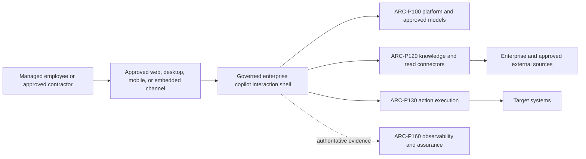
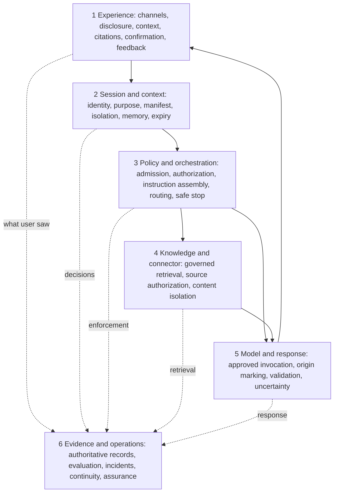
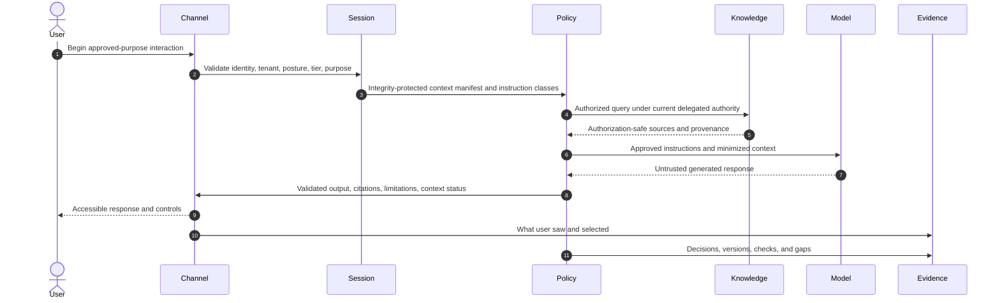
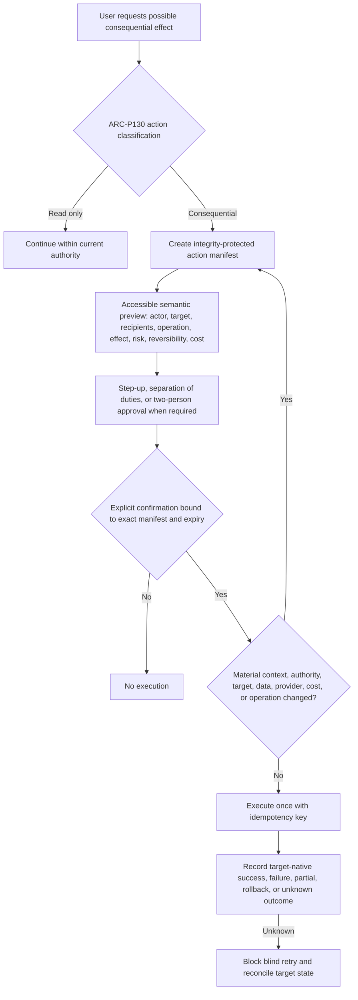
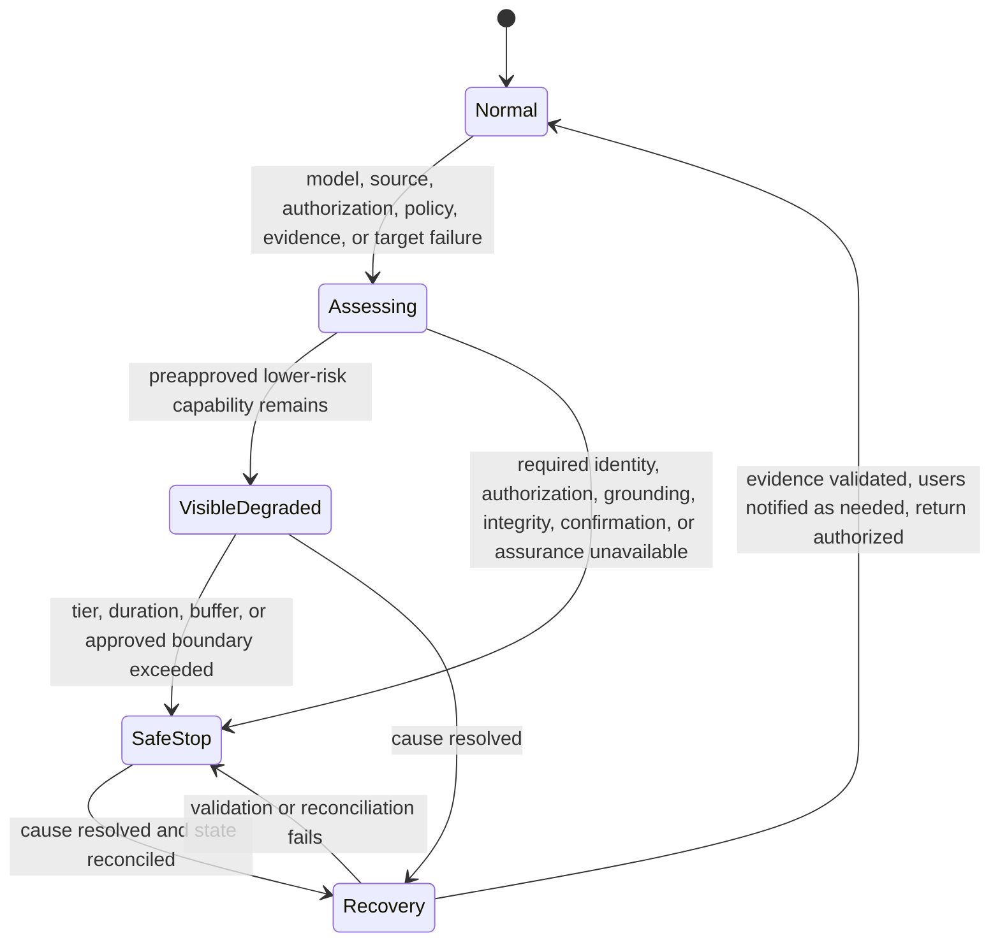

# ARC-P110 Enterprise Copilot

## Metadata

**Pattern ID:** ARC-P110

**Status:** Draft

**Version:** 0.1.0

| Field | Value |
|---|---|
| Owner | Enterprise Architecture |
| Required reviewers | Security Architecture, Privacy, Data Governance, AI Engineering, Application Security, Operations, Accessibility, Legal, Records Management, Assurance |
| Approval date | Not approved (Draft) |
| Review date | Before approval; then at the organization-defined architecture review interval |
| Pillars | Protect AI, Utilize AI, Govern AI |
| Lifecycle stages | Architecture, Development, Validation, Approval, Deployment, Operations, Monitoring, Retirement |
| Capability tiers | Tier 1 through Tier 4; isolated Tier 0 experimentation only |
| Deployment models | Cloud, hybrid, on-premises, managed service, endpoint, and high-assurance deployment forms |
| Primary pattern role | Human-facing enterprise copilot interaction pattern |
| Supersedes | None |

## Purpose

Provide a vendor-neutral, governed interaction shell with federated enforcement for general-purpose enterprise copilots used by employees and approved contractors through enterprise-managed identities and channels. The pattern governs identity, session, purpose, context, disclosure, sources, response handling, memory, connector use, confirmation, feedback, accessibility, records, evidence, and safe failure.

## Problem statement

Enterprise copilots combine conversational interfaces, user and enterprise context, models, retrieval, connectors, memory, and possible actions. Inconsistent channel controls can hide material context, amplify access, treat untrusted content as instructions, persist sensitive information, misrepresent generated content, or turn conversational ambiguity into consequential effects. A consistent human-facing contract is required even when enforcement is central, regional, application-adjacent, or channel-adjacent.

## Intended outcomes

- Attributable use by managed workforce identities for approved purposes.
- Clear disclosure of AI operation, limitations, material context, sources, memory, and consequential effects.
- Session-scoped context and memory by default, with separately governed opt-in durable memory.
- Authorization-aware knowledge and read-oriented connectors that do not amplify access or transfer it to recipients.
- Distinguishable generated, user-authored, quoted, retrieved, connector, action-result, and enterprise-record content.
- Explicit, accessible, action-specific confirmation bound to the exact consequential effect.
- Accessible correction, challenge, feedback, and human escalation without retaliation.
- Privacy-tiered authoritative evidence and unambiguous refused, degraded, failed, partial, rollback, and unknown states.

## Non-goals

This pattern does not select suppliers, define a visual design system, configure a productivity suite, set universal content-safety thresholds, authorize customer or public use, establish industry-specific employment rules, create a general autonomous-agent pattern, or claim external-standard compliance. It does not authorize unrestricted enterprise search, autonomous action, model training on enterprise interactions, covert employee monitoring, or persistent memory by default.

## Applicability

Use ARC-P110 for employee and approved-contractor conversational assistance, generation, summarization, transformation, drafting, analysis, translation, user-selected files, governed enterprise knowledge, read-oriented connectors, source attribution, feedback, optional governed personalization, and human-confirmed ARC-P130 actions. The baseline uses managed workforce identities, session-scoped context and memory, authorization-aware enterprise knowledge, read-oriented connectors, and exact confirmation for consequential action. Live multi-user sessions and customer or public use are outside the baseline.

Apply the pattern to Tier 1 through Tier 4 capabilities, with controls and safe failure strengthened by tier. Tier 0 experimentation is isolated, non-production, and cannot silently promote context, evidence, configuration, or behavior. Deployment may be cloud, hybrid, on-premises, managed service, endpoint, or a high-assurance enclave.

## Assumptions and prerequisites

- Managed workforce identity, device or channel posture, tenant, purpose, capability tier, and policy authority are established.
- ARC-P100 supplies approved model access, provider routing, and shared policy enforcement; ARC-P120 supplies authorization-aware retrieval, grounding, and citations; ARC-P130 governs delegated execution; ARC-P160 supplies authoritative evidence, evaluation, monitoring, and assurance.
- Enterprise classification, privacy, data-loss prevention, accessibility, records, incident, continuity, and assurance functions exist.
- Sources expose authoritative authorization or an equivalently authoritative boundary, and provider and connector gaps are documented.
- Supporting patterns never broaden the user's data access, authority, purpose, provider, retention, or action scope.

## Prohibited uses

Do not use the baseline for guests or unmanaged identities, live multi-user or link-shared sessions, customers, public users, autonomous action, unrestricted search, hidden surveillance, emotion or protected-trait inference, undisclosed performance scoring, secondary employment decisions, or training on enterprise interactions. Redesign is required when identity, tenant binding, purpose, current authorization, instruction integrity, required grounding, exact confirmation, or required assurance cannot be established. Material provider or connector evidence gaps prohibit the affected source, tier, or operation.

## Architecture views

### Figure 1. Context view

### Figure 2. Six-layer component view

### Figure 3. Governed interaction flow

### Figure 4. Consequential action confirmation

### Figure 5. Degraded mode and recovery

The responsibility view is the component table and CP1-CP18 matrix below. Deployment places enforcement centrally, regionally, application-adjacent, or channel-adjacent only when policy authority, identity, context, evidence, bypass protection, residency, and recovery remain explicit.

## Actors and identities

Every session binds a validated managed workforce identity, tenant, role, approved purpose, tier, assurance level, policy version, channel, device or access posture, and expiry. Caller-supplied identity and tenant values are untrusted. Session identifiers are opaque, unpredictable, time-bounded, scoped, and rotated after authentication or privilege change.

The capability reauthenticates or requires step-up for sensitive context, privilege changes, protected exports, durable-memory changes, and consequential actions. Authorization is continuously reevaluated after account, contractor, group, device, risk, source ACL, channel, or policy change. Stale group membership, shared-account ambiguity, and silent impersonation do not establish authority.

Privilege elevation, impersonation, support, and break-glass use separate managed identities, approvals, bounded purpose and duration, protected ARC-P160 recording where appropriate, and review. Routine sessions never inherit administrative authority. Application Owner, AI Service Owner, Business Owner, Data Owner, Knowledge Owner, Model Owner, Agent Owner, IAM, Security Operations, Records Management, Assurance, and catalog `owner_role` responsibilities remain explicit; implementation evidence duties never transfer catalog accountability.

## Data and instruction flows

The session maintains an integrity-protected machine-readable context manifest covering selected files, sources, conversation state, connected applications, memory, inferred attributes, policy context, versions, classification, purpose, and expiry. Users receive a comprehensible representation and controls for user-selectable material context, including additions, exclusions, changes, staleness, and unavailability. Mandatory legal, policy, safety, security, and evidence context may be abstracted safely but is not user-disableable. The final material context remains available after consequential use.

Instruction classes are enterprise policy, platform instruction, capability instruction, user instruction, and untrusted content, in that order of authority. Hidden context is limited to owned, inventoried, classified, versioned, integrity-protected, tested system, safety, and security instructions. Retrieved material, attachments, connector output, external content, and model output remain untrusted unless a governed transformation changes class; they cannot redefine identity, policy, authority, confirmation, evidence, or precedence. Conflicts are rejected, isolated, or disclosed.

Attachments, pasted text, URLs, images, archives, code, office documents, imported conversations, and connector responses are isolated and treated as untrusted. Actual and declared type, size, nesting, compression, active content, links, OCR, objects, metadata, classification, ownership, provenance, inspection, and purpose are validated. Least-privilege parsers use bounded resources and restricted networking; active content is never executed. URL handling resists SSRF, redirects, unsafe downloads, credentials, tracking, and egress.

Authorization applies at discovery, retrieval, presentation, sharing, and export. It covers indexes, embeddings, caches, previews, snippets, counts, citations, errors, and derived inference. Source or equivalent authorization is checked at query time and again before display or export; access changes during long sessions are enforced. Sharing or exporting establishes a recipient-specific boundary: the originator's read access does not transfer.

Citations bind claims to accessible source versions, locations, retrieval time, authorization context, and lineage. Presentation is authorization-safe while protected evidence retains the complete decision context. Citation correctness, coverage, freshness, contradiction, and unsupported claims are assessed independently; citation count is not proof. Output classification, data-loss, attribution, executable-content, and downstream-safety controls apply separately at display, copy, download, share, email, export, and connector-output boundaries.

Memory is session-scoped by default. Durable memory requires separate approval and explicit purpose-specific opt-in; ambiguous conversation, feedback, or inference cannot create it. Each item records provenance, creation method, confidence, purpose, expiry, correction history, and policy. Users can inspect, correct, restrict, and delete it where permitted. Identity, tenant, purpose, environment, capability, retention, residency, access, hold, export, revocation, backup, deletion, and retirement are governed across primary and derived stores.

For consequential use, an integrity-protected action manifest binds actor, delegated identity, target, recipients, operation, exact data or protected integrity-bound references, parameters, expected effect, risk, reversibility, material cost, expiry, and idempotency key. Protected values need not appear literally in the preview when an integrity-bound reference and safe inspection path preserve informed confirmation. Confirmation is explicit, accessible, time-bounded, and cryptographically or transactionally bound; any material change invalidates it.

Feedback is minimized, purpose-limited, disclosed, access-restricted, poisoning-checked, protected from retaliation, and separated from performance management. It cannot silently alter records, policy, memory, training, model behavior, or rights. Prompts, outputs, context, files, retrievals, memory, feedback, exports, and telemetry are classified and purpose-bound; ordinary logs, tickets, analytics, alerts, and support systems do not collect general interaction content by default.

## Trust boundaries

| Zone | ARC-P110 placement and boundary rule |
|---|---|
| Z0 External/untrusted | User-supplied and internet content, external sources, and provider services remain untrusted regardless of contract. |
| Z1 User endpoint/channel | Approved clients authenticate the user, disclose AI operation, expose context and status, and never become the authority for identity or policy. |
| Z2 Enterprise access edge | Validates channel, identity, tenant, device posture, session, rate, schema, and admission. |
| Z3 Application/session | Isolates user, tenant, purpose, conversation, files, memory, caches, exports, and support access. |
| Z4 Policy/orchestration | Owns instruction precedence, authorization, context minimization, routing, action classification, and safe-stop decisions. |
| Z5 Data, connector, and target | Enforces source- and operation-specific delegated authority and target-native outcome records. |
| Z6 Model/provider | Receives only approved, minimized context under documented processing, retention, region, version, and gap conditions. |
| Z7 Evidence/assurance | Independently protects privacy-tiered evidence, evaluation, incident, continuity, and assurance records without a workload bypass path. |

Each material crossing records validated actor and tenant, purpose, authorization, classification, instruction class, schema and integrity, encryption, retention, residency, provider, correlation, timeout, capacity, evidence, and safe-failure behavior. Channel transfer, resume, synchronization, or device change revalidates identity, posture, context, source authorization, and policy before restoring state.

## Components and responsibilities

| Component | Required responsibility |
|---|---|
| Experience shell | Approved channels, disclosure, accessibility, context controls, content-origin labels, citations, previews, confirmations, status, challenge, feedback, export, and session controls |
| Session and context service | Identity/tenant/purpose binding, opaque sessions, isolation, machine and user manifests, context lifecycle, memory state, and expiry |
| Policy and orchestration service | Admission, continuous authorization, instruction assembly and integrity, routing, content/output policy, resource limits, action classification, fallback, and safe stop |
| Attachment and URL isolation service | Type validation, scanning, extraction, rendering, parser sandboxing, URL safety, resource bounding, and provenance |
| Knowledge and connector service | Read-oriented delegated access, query-time and presentation-time authorization, ARC-P120 grounding, authorization-safe citations, and gap management |
| Model and response service | ARC-P100-approved models and versions, instruction separation, response validation, origin marking, uncertainty, and downstream safety |
| Action and confirmation service | ARC-P130 action manifests, semantic preview, step-up, exact confirmation binding, idempotency, execution, and reconciliation |
| Memory service | Optional opt-in item governance, isolation, provenance, correction, deletion, hold, and lifecycle propagation |
| Evidence and operations service | ARC-P160 evidence of what the user actually saw, privacy-tiered capture, evaluation, incidents, capacity, continuity, recovery, records, and assurance |

## Required controls

| Allocation | Controls | Implementation and evidence responsibility |
|---|---|---|
| Required: governance and risk | `GOV-130`; `RSK-110`, `RSK-120`, `RSK-130`, `RSK-140` | Enterprise Architecture, Capability Owner, and Risk Management |
| Required: identity | `IAM-100`, `IAM-110`, `IAM-120`, `IAM-130`, `IAM-140`, `IAM-150` | IAM and Application Owner |
| Required: data and privacy | `DAT-100`, `DAT-110`, `DAT-120`, `DAT-130`, `DAT-140`, `DAT-160` | Data Owner and Privacy |
| Required: application | `APP-100`, `APP-110`, `APP-120`, `APP-130`, `APP-140`, `APP-150` | Application Owner and Application Security |
| Required: boundary, resources, model | `API-110`, `INF-150`, `MOD-120` | API Owner, Platform Engineering, Model Validation Lead |
| Required: architecture | `ARC-100`, `ARC-110`, `ARC-130`, `ARC-140` | Enterprise and Solution Architecture |
| Required: operations and monitoring | `OPS-100`, `OPS-110`, `OPS-120`, `OPS-130`, `OPS-140`; `MON-100`, `MON-110`, `MON-120`, `MON-140`, `MON-150` | AI Service Owner, Operations, Security Operations |
| Required: assurance, compliance, workforce | `AUD-110`, `AUD-120`; `CMP-100`, `CMP-110`; `EDU-100`, `EDU-120` | Assurance, Compliance, and Workforce Learning |
| Inherited and verified | `GOV-100`, `GOV-110`, `GOV-120`, `GOV-140`, `RSK-100`, `API-100`, `INF-100`, `INF-110`, `INF-120`, `INF-130`, `INF-140`, `MOD-100`, `MOD-110`, `MOD-130`, `MOD-140`, `DAT-150`, `ARC-120`, `ARC-150`, `AUD-100`, `AUD-130`, `AUD-140` | Verify enterprise governance, ARC-P100, ARC-P120, approved model, architecture lifecycle, and assurance evidence in this capability |
| Conditional | `API-120` for plugins/connectors; `API-130` for MCP/orchestration; `API-140` for external AI/connectors; `API-150` for portability/concentration; `AGT-100`, `AGT-110`, `AGT-120`, `AGT-130`, `AGT-140`, `AGT-150`, `AGT-160`, `MON-130`, and ARC-P130 for actions/agents; `CMP-120`, `CMP-130`, `CMP-140` for third parties, jurisdiction, residency, IP, and licensing; `MOD-150`, `OPS-150` for retirement; `EDU-130` for developer copilots; `EDU-110`, `EDU-140` for specialized operators/governors; `STR-110` for measured value claims | Trigger owner documents applicability, implementation, evidence, exceptions, and exit |

Catalog `owner_role` remains accountable. Required controls are implemented directly, inherited controls are verified in the copilot context, and conditional controls are activated only by documented triggers; these allocations are not interchangeable.

## Control points and overlays

| CP | Control point | Required outcome | Primary implementation and evidence roles |
|---|---|---|---|
| CP1 | Channel and managed-user admission | Only approved channels, identities, tenants, devices, purposes, and capability states enter a session | Application Owner; IAM and Channel Owner produce evidence |
| CP2 | Session, tenant, and purpose binding | All context and operations remain bound to validated identity, tenant, purpose, tier, policy, and expiry | Application Owner; IAM and Application Engineering |
| CP3 | User notice and AI disclosure | Users understand AI operation, material limitations, processing, records, and monitoring | Compliance; Product, UX, Legal, and Accessibility |
| CP4 | Context selection and minimization | Material context is visible, controllable, necessary, classified, and purpose-bound | Data Owner; Application Engineering and Privacy |
| CP5 | Attachment and imported-content inspection | Untrusted content is validated, isolated, bounded, and prevented from changing authority or policy | Application Owner; Security Engineering |
| CP6 | System-instruction and policy integrity | Hidden instructions and policy are owned, versioned, protected, tested, and precedence-enforced | Application Owner; Platform Engineering and Change Authority |
| CP7 | Retrieval and connector authorization | Read access remains within current user, source, tenant, purpose, and session authority | Technical Owner; IAM, Knowledge Owner, and API Owner |
| CP8 | Prompt-injection and instruction-conflict handling | Untrusted instructions cannot override identity, policy, authorization, confirmation, or evidence | Application Owner; Application Security and Retrieval Engineering |
| CP9 | Model and provider routing | Only approved models, providers, regions, versions, and processing conditions are selected | AI Platform Owner; Model Owner and Gateway Operations |
| CP10 | Output validation and sensitive-data protection | Unsafe, unauthorized, unsupported, or executable outputs are blocked, transformed, or disclosed | Application Owner; Privacy, DLP, and Application Engineering |
| CP11 | Citation, provenance, and uncertainty presentation | Claims, sources, transformations, freshness, limitations, and uncertainty are accurately represented | Data Governance and Business Owner; Application and Retrieval Engineering |
| CP12 | Memory and personalization governance | Durable state is optional, visible, purpose-bound, isolated, correctable, deletable, and lifecycle-governed | Data Owner; Privacy and Application Engineering |
| CP13 | Action preview, confirmation, and reauthorization | Consequential actions execute only after exact informed confirmation under ARC-P130 | Business Owner; Application Owner, Agent Owner when applicable, and UX |
| CP14 | Feedback, challenge, correction, and appeal | Users can contest outputs and correct state without creating uncontrolled secondary effects | Business Owner; Product Operations, Data Governance, and Compliance |
| CP15 | Records, export, retention, and deletion | Source and derived interaction records follow classification, rights, hold, and disposition rules | Compliance; Data Owner, Privacy, and Records Management |
| CP16 | Session termination and context disposal | Session context, delegated credentials, temporary files, caches, and authority expire or are retained only as approved | Application Owner; Application and Platform Engineering |
| CP17 | Evidence, evaluation, monitoring, and incident integration | Privacy-tiered authoritative evidence supports quality, security, operations, incidents, and assurance | AI Service Owner; Security Operations, Model Validation, Assurance, and Incident Response |
| CP18 | Degraded mode, safe stop, recovery, and retirement | Failure is explicit, authority never expands, consequential use stops safely, and recovery is verified | Business Continuity and Business Owner; AI Service Owner, SRE, and Assurance |

Apply overlays for Tier 3 and Tier 4; regulated, personal, confidential, privileged, or export-controlled data; multi-tenancy; external providers; agents and consequential actions; developer and executable outputs; workforce impact; safety impact; regional residency; high-assurance enclaves; endpoint, edge, or disconnected operation; accessibility; and records or legal hold.

## Architecture decisions and parameters

The mandatory decision is a **governed interaction shell with federated enforcement**. A consistent enterprise contract applies across approved channels, while control placement may vary only when policy authority, context, identity, evidence, ownership, and bypass protection remain explicit.

Organization-defined parameters cover approved users, channels, devices, purposes, tiers, data classes, sources, connectors, models, providers, regions, context limits, session and reauthorization duration, memory eligibility and expiry, citation quality, output boundaries, action classes, confirmation expiry, step-up and dual approval, cost thresholds, evidence capture mode, retention, accessibility, rate and capacity, degraded capability and duration, stop conditions, recovery authority, review frequency, and retirement.

Material changes in identity, authority, context, target, data, source, model, provider, region, policy, retention, memory, cost, operation, or expected effect invalidate affected assumptions, disclosures, evaluations, or confirmations. Dashboards and aggregates are operational conveniences, not authoritative evidence.

## Failure modes and abuse cases

| Failure or abuse | Required treatment |
|---|---|
| Session fixation, stale group, shared account, silent impersonation, cross-user/tenant/purpose leakage | Reject or terminate, rotate state, revoke delegated credentials, contain and investigate; never infer authority |
| Hidden or malicious attachment, URL, metadata, image, code comment, email signature, or retrieved instruction | Isolate and classify as untrusted; block execution and authority changes; record conflict and inspection result |
| Unauthorized discovery, stale cache, inaccessible citation, restricted-fact inference, or recipient access loss | Reauthorize before discovery, retrieval, presentation, sharing, and export; withhold content and existence signals |
| Fabricated, substituted, stale, contradictory, or unsupported citation | Label limitations, block unsupported high-impact use, preserve provenance, and evaluate quality dimensions separately |
| Sensitive or executable output escapes through copy, file, email, share, export, or connector | Enforce boundary-specific classification, DLP, labeling, transformation, sandbox, or block |
| Memory created without opt-in, poisoned, stale, cross-user, or undeletable | Reject or quarantine, disclose state, correct or restrict, propagate lifecycle actions, and preserve lawful hold accurately |
| Bundled, hidden, ambiguous, inaccessible, stale, or deceptive confirmation | Do not execute; regenerate the final manifest and accessible preview; require exact confirmation and step-up as applicable |
| Timeout, duplicate, partial action, eventual completion, or unknown outcome | Never report success from inference; use idempotency and target-native evidence; reconcile before retry |
| Feedback poisoning, retaliation, or secondary employment use | Restrict access and purpose, separate from performance systems, validate data, provide challenge and independent review |
| Provider/connector outage, changed semantics, residency, retention, evidence, or failover gap | Disclose and record gap; do not silently fail over; prohibit affected source, tier, operation, or provider when assurance fails |
| Evidence loss or backend/UI mismatch | Preserve minimized decision record, stop required use, and use ARC-P160 evidence of what the user actually saw |
| Degraded mode widens data, authority, provider, memory, connector, retention, or action scope | Reject transition and enter safe stop |

## Fallback recovery and retirement

The interface distinguishes no answer, insufficient evidence, stale or incomplete sources, refusal, unavailable model or connector, degraded function, partial completion, failed action, rollback, and unknown outcome. A tiered capability matrix specifies allowed data, provider, source, memory, connector, action, duration, evidence, and recovery authority for each failure.

Lower-risk Tier 1 and Tier 2 assistance may continue only in a visible, preapproved degraded mode with reduced data, sources, functions, and duration. Tier 3 and Tier 4 advisory use safely stops when identity, authorization, required grounding, integrity, or assurance is unavailable. Consequential actions stop when confirmation or target-state evidence is unavailable. Advisory safe-stop evidence is distinct from action outcome evidence; neither can substitute for the other.

Recovery resolves cause, revalidates identity and policy, reconciles context and target state, validates authoritative evidence and backfill, renews confirmation when material context changed, notifies affected users where appropriate, and requires authorized return to normal. Retirement disables channels, sessions, connectors, credentials, models, memory, and actions; exports, retains, deletes, or holds source and derived records consistently; verifies provider and backup disposition; and preserves required tombstones and assurance evidence.

## Evidence and assessment

Required evidence includes approved audience, channels, purposes, tiers, models, providers, connectors, sources, ownership, data/instruction flows, and the CP1-CP18 assurance matrix. Tests cover session fixation, step-up, continuous authorization, expiry, revocation, cross-user/session/tenant/device isolation, channel transfer, impersonation, privileged access, and support access.

Assessment inspects machine-readable and user-visible context manifests, mandatory-context protection, context-change invalidation, hidden-instruction inventory and integrity, attachment and URL isolation, prompt injection, discovery/retrieval/presentation/sharing/export authorization, recipient access, inaccessible-source inference, citation correctness and authorization-safe presentation, and output controls at display, copy, download, share, email, export, and connector boundaries.

Evidence covers memory opt-in and item provenance, correction/deletion/hold/isolation, action-manifest integrity, protected-value inspection, accessible semantic preview, step-up/dual approval, exact binding, idempotency and unknown-outcome reconciliation, accessibility and deceptive-UX tests, feedback anti-retaliation, minimized decision records, records/privacy/monitoring controls, and provider/connector gap registers.

ARC-P160 correlates the user-visible context, sources, notices, policy and instruction versions, model/provider, response, citations, memory state, preview and confirmation interface actually shown, action manifest, target-native outcome, feedback, and degraded-state decision. It preserves a minimized integrity-protected snapshot for material decisions and actions. Runtime services and ordinary administrators cannot selectively suppress, rewrite, or omit this authoritative evidence; operational dashboards do not replace it.

Negative tests include stale authorization, restricted inference, malicious files/URLs/instructions, citation substitution, memory and feedback poisoning, inaccessible or deceptive confirmations, time-of-check/time-of-use change, duplicate/partial/unknown actions, provider failover changes, policy rollback, content copied into general telemetry, evidence loss, recipient authorization loss, and unsafe degraded continuation. Acceptance requires all six named layers, all 18 control points, resolved controls, explicit accountability, substantive template sections, linked Draft registry status, and passing architecture, control, and repository validation.

## Variants and alternatives

- **General productivity copilot:** broad drafting and analysis with limited enterprise context; prefer when specialized data or action authority is unnecessary.
- **Knowledge-grounded copilot:** composes ARC-P120; gains grounding while adding authorization, freshness, citation, and index-governance obligations.
- **Developer copilot:** adds code, repository, build, secret, license, dependency, sandbox, executable-output, and software-assurance controls.
- **Role-specialized copilot:** adds bounded domain data, vocabulary, workflows, validation, and accountable outcomes.
- **Embedded application copilot:** improves workflow context but explicitly separates host authority from copilot authority.
- **Offline or high-assurance enclave:** limits providers, connectors, and collaboration for isolation at the cost of convenience and freshness.
- **Accessibility-focused mode:** provides equivalent multimodal access without weakening disclosure, context visibility, confirmation, privacy, or evidence.

## Anti-patterns

- Treating login as authorization to all enterprise information or transferring the originator's read access to recipients.
- Hiding material context, memory, provider, source, degradation, or action state.
- Making mandatory policy, safety, security, or evidence context user-disableable.
- Persisting conversation or personalization by default, or turning feedback into memory or training silently.
- Treating attachments, URLs, retrieved content, connector output, or model output as trusted instructions.
- Treating citation presence, numeric confidence, provider consoles, logs, dashboards, or aggregates as authoritative evidence.
- Allowing writes, sends, submissions, approvals, purchases, access changes, or code execution without exact confirmation.
- Treating silence, continued conversation, prior approval, preselected controls, timing, or inaccessible UI as consent.
- Retrying an unknown action outcome before target reconciliation.
- Copying prompts, responses, files, or sensitive context into general logs, alerts, tickets, analytics, or support tools.
- Using the copilot for hidden workforce monitoring or secondary employment decisions.
- Continuing consequential assistance when authorization, grounding, confirmation, integrity, or assurance is unknown.
- Claiming productivity, quality, or safety benefit without defined measures and limitations.

## Related patterns

- `ARC-P100` supplies approved model access, provider routing, shared policy enforcement, and platform boundaries.
- `ARC-P120` supplies authorization-aware retrieval, grounding, citations, corpus controls, and semantic-memory boundaries.
- `ARC-P130` supplies delegated execution, tool/action authority, exact confirmation, transaction, and outcome handling.
- `ARC-P160` supplies authoritative user-visible evidence, evaluation, monitoring, incidents, continuity, and assurance.

## Change history

| Pattern version | ESAF release | Date | Change |
|---|---|---|---|
| 0.1.0 | 0.4-alpha | 2026-07-12 | Initial draft |
