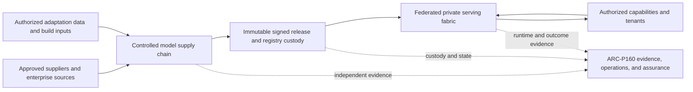
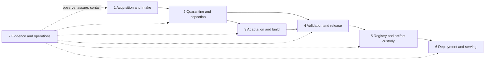
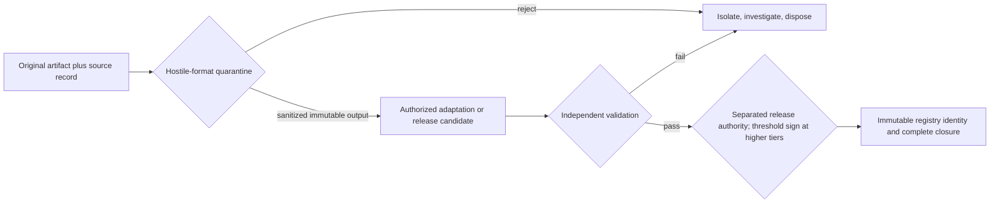
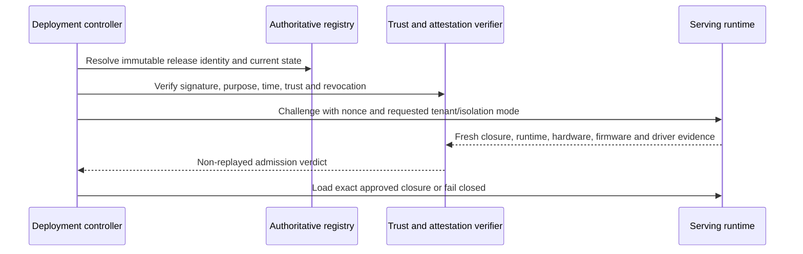
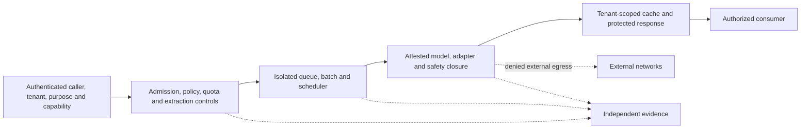
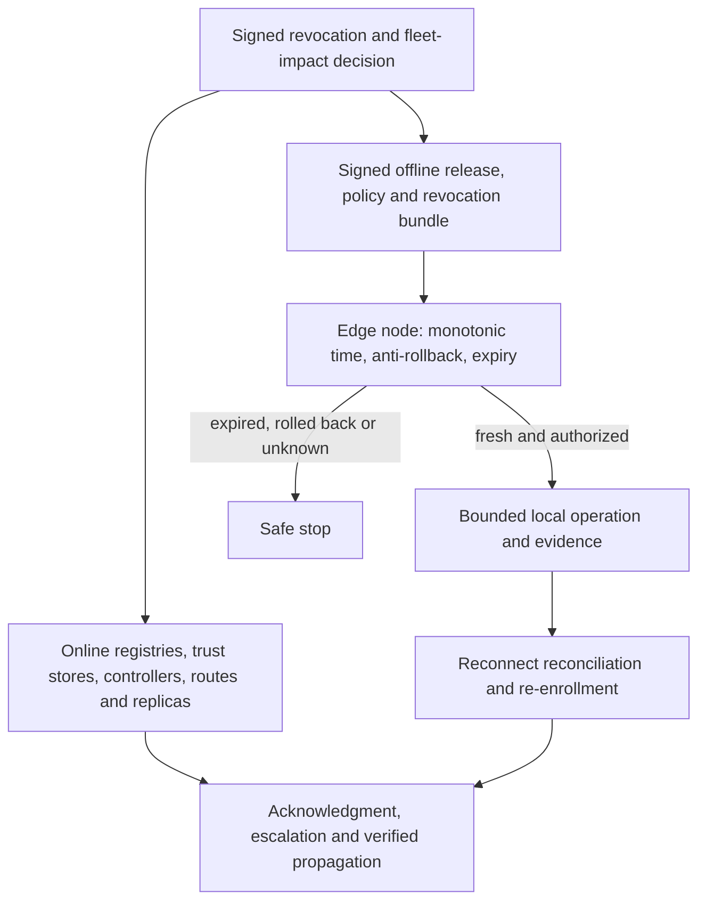
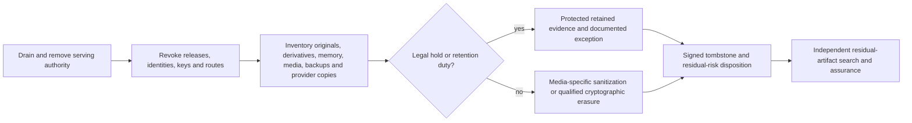

# ARC-P140 Private model deployment

## Metadata

**Pattern ID:** ARC-P140

**Status:** Draft

**Version:** 0.1.0

| Field | Value |
|---|---|
| Owner | Enterprise Architecture |
| Required reviewers | Security Architecture, Model Validation, Data Governance, Legal, Privacy, AI Platform Engineering, Operations, Business Continuity, Records Management, Assurance |
| Approval date | Not approved (Draft) |
| Review date | Before approval; then at the organization-defined architecture review interval |
| Pillars | Protect AI, Utilize AI, Govern AI |
| Lifecycle stages | Model selection, Data readiness, Architecture, Development, Validation, Approval, Deployment, Operations, Monitoring, Continuous improvement, Retirement |
| Capability tiers | Tier 1 through Tier 4; isolated Tier 0 experimentation |
| Deployment models | On-premises, private cloud, dedicated hosted, hybrid, regional, confidential computing, disconnected or edge |
| Primary pattern role | Primary private-model lifecycle and serving pattern |
| Supersedes | None |

## Purpose

Provide a vendor-neutral controlled model supply chain and federated serving fabric for enterprise-controlled acquisition, adaptation, release, custody, deployment, private inference, revocation, and retirement. Private denotes custody and control boundaries; network placement or a private label is not evidence of confidentiality, integrity, safety, isolation, or compliance.

## Problem statement

Model weights are only one part of an executable release. Tokenizers, templates, loaders, adapters, kernels, dependencies, runtimes, drivers, firmware, safety settings, and hardware compatibility can change behavior or introduce hostile code. Without one immutable release identity and separated lifecycle gates, inspection can be bypassed between download and load, suppliers or administrators can silently substitute components, derived artifacts lose license and data obligations, and shared serving leaks tenant state. Distributed deployments also make revocation, recovery, evidence, and destruction difficult to prove.

## Intended outcomes

- Attributable source, supplier, license, lineage, transformation, ownership, and custody.
- Hostile-artifact containment and sanitized promotion before any trusted use.
- Authorized, reproducible adaptation with classified intermediate artifacts and deletion propagation.
- Independently validated, purpose- and tier-scoped, immutable signed release closures.
- Authoritative registry history, governed trust anchors, encrypted custody, and immutable runtime admission identity.
- Empirically demonstrated tenant, adapter, scheduler, cache, accelerator, telemetry, backup, support, and administrative isolation.
- Deny-by-default inference egress, governed import and export, extraction resistance, fair capacity, and safe failure.
- Independent ARC-P160 evidence for fleet impact, incidents, recovery, revocation, retirement, and verifiable destruction.

## Non-goals

This pattern does not define foundation-model pretraining from scratch, select model or accelerator products, prescribe universal performance, safety, or side-channel thresholds, implement a data-engineering platform, configure a particular cloud service, claim confidential computing eliminates infrastructure risk, or assert mappings to external standards.

## Applicability

Use ARC-P140 when the enterprise operates or controls model artifacts and private inference, including acquired, open, commercial, internally developed, fine-tuned, adapter-based, quantized, converted, pruned, or packaged models. Apply it across on-premises, private-cloud, dedicated-hosted, hybrid, regional, confidential-computing, and disconnected or edge forms. Tier 1 through Tier 4 use risk-proportionate controls; Tier 4, incompatible legal or data domains, untrusted adapters, or unbounded side-channel risk require dedicated boundaries. Tier 0 is limited to governed, isolated experimentation without production data, authority, or promotion paths.

Adaptation and build activities, evidence, CP6 and CP7 apply when fine-tuning, adapter creation, quantization, conversion, pruning, packaging, or another material transformation occurs. An inference-only deployment records CP6 and CP7 as not applicable with rationale; CP1 through CP5 and CP8 through CP21 remain applicable. Provider-operated endpoints lacking sufficient enterprise control and evidence over artifact identity, runtime integrity, isolation, lifecycle, and destruction remain external services.

## Assumptions and prerequisites

- Enterprise identity, classification, privacy, legal, procurement, key management, change, incident, continuity, records, and assurance services exist.
- Capability purpose, tier, owners, approved uses, data authority, residency, recovery objectives, and evidence retention are decided before promotion.
- Organization-defined limits exist for evidence and attestation freshness, trusted-time skew, isolation leakage, extraction, capacity, offline duration, revocation latency, and recovery.
- ARC-P160 supplies independently administered, append-only or WORM-capable authoritative evidence with trusted time and gap detection.
- Source and provider assertions are classified by assurance strength; contracts or physical placement do not erase supplier boundaries.

## Prohibited uses

Do not use this pattern to justify direct production downloads, mutable tags as identity, unrestricted runtime internet access, self-approval across build or release boundaries, silent component or provider substitution, shared serving without empirical isolation evidence, restoration of ineligible artifacts, or unverifiable retirement. It cannot support acceptable risk when immutable release identity, current authorization, license compatibility, independent validation, trust-anchor integrity, required isolation, revocation, evidence, or destruction cannot be established.

## Architecture views

### Figure 1. Context and custody view

Custody is recorded for artifacts, keys, data, compute, firmware, administration, backups, telemetry, support, and destruction. Shared responsibility remains explicit across hosted and regional boundaries.

### Figure 2. Seven-zone component view

The zones are logical responsibility and authority boundaries, not proof supplied by subnets or physical co-location.

### Figure 3. Artifact-promotion view

Only sanitized outputs cross quarantine. A transformation creates a new identity and lineage edge; build workers cannot write the trusted registry.

### Figure 4. Deployment and admission view

Registry, signature, deployment, load, and attestation use the same immutable release closure, preventing time-of-check/time-of-use substitution.

### Figure 5. Serving view

Tenant identity is authoritative at admission and preserved through batching, cache, inference, telemetry, backup, support, and response.

### Figure 6. Online and offline revocation view

Revocation covers active sessions, adapters, caches, mirrors, credentials, backups and restore eligibility; a missed maximum propagation bound causes escalation or safe stop.

### Figure 7. Retirement and destruction view

Destruction is verifiable only when replica coverage, key-destruction prerequisites, provider copies, device memory, and residual searches are evidenced.

## Actors and identities

Model Owner, Data Owner, AI Capability Business Owner, AI Capability Technical Owner, AI Platform Owner, Application Owner, supplier, Procurement, Legal, Privacy, Model Validation Lead, build and ML operations, Release Authority, registry and artifact custodians, trust-anchor and cryptographic services, deployment controller, runtime operations, backup and records custodians, support personnel, Incident Response, Security Operations, Assurance, and Internal Audit use distinct named identities. Workload identities are short-lived and bound to purpose, tier, tenant, environment, and release.

Build, validation, signing, registry administration, trust-anchor administration, deployment, runtime, KMS, backup, support, destruction, and assurance are separated privileged functions. Builders cannot validate or promote their candidate; validators cannot sign it; signers cannot change registry approval; registry administrators cannot alter trust roots; deployment or runtime administrators cannot promote artifacts, weaken egress, change trust stores, or suppress evidence. Just-in-time and break-glass access is purpose- and time-bounded, independently approved for high-impact work, recorded, automatically expired, and reviewed for conflicts and orphaned credentials.

## Data and instruction flows

Intake records original hashes, signatures, supplier, license, permitted use, bills of materials, notices, classification, and custody. Quarantine treats model formats, pickle and serialized objects, archives, tokenizers, templates, loaders, plugins, native extensions, kernels, scripts, and dependencies as hostile; it tests parser and decompression attacks, remote-code behavior, path traversal, symlinks, oversized shards, and resource bombs in disposable workers without enterprise credentials, writable registry access, or unrestricted egress.

Adaptation binds approved base identity, dataset authority, classification, minimization, consent or legal basis, licensing, quality, representativeness, code, parameters, randomness, operator, ephemeral compute, and outputs. Training, validation, and holdout sets are separated. Poisoning, backdoors, contamination, leakage, secrets, regulated data, and memorization are tested. Checkpoints, gradients, optimizer state, adapters, caches, logs, metrics, reports, samples, and failures receive the highest applicable classification and obligations. Correction and deletion propagate to dataset versions and derived artifacts where required; retraining, adapter replacement, restriction, or other remediation is evaluated, and unlearning is never claimed beyond demonstrated limits.

License and acceptable-use compatibility is evaluated transitively across base model, code, data, adapters, dependencies, output use, deployment, distribution, and derivatives. Changed or revoked terms trigger lineage-based fleet impact and may prohibit adaptation, release, use, or distribution. Artifact access never implies permission to copy, export, adapt, merge, redistribute, or repurpose.

A release manifest binds every weight shard, tokenizer, vocabulary, prompt and chat template, adapter, speculative model, loader, kernel, dependency, runtime image, safety configuration, precision, and approved hardware, firmware, and driver class. Import, dependency resolution, activation, support, telemetry export, and artifact export use authenticated, authorized, inspected, logged channels with destination, license, classification, encryption, residency, DLP, bounded queues, and reconciliation.

## Trust boundaries

| Named lifecycle zone | ESAF logical mapping | Material crossings and custody requirements |
|---|---|---|
| Acquisition and intake | Z0 External and untrusted; Z7 Security, operations, and assurance | Controlled transfer authenticates source, preserves original identity, classification, license, custody, direction, evidence, and failure state. |
| Quarantine and inspection | Z7 Security, operations, and assurance | Disposable hostile-workload isolation accepts only bounded input and emits sanitized, integrity-bound output; no production identity, lateral path, or registry write exists. |
| Adaptation and build | Z4 Model and inference; Z5 Enterprise data and knowledge; Z7 Security, operations, and assurance | Data and artifact authority, read-only inputs, short-lived identity, default-deny egress, bounded resources, controlled output staging, and evidence are enforced. |
| Validation and release | Z4 Model and inference; Z7 Security, operations, and assurance | Independent evaluators receive an immutable candidate; release authority signs the same closure only after current purpose, tier, license, evidence, and conflict checks. |
| Registry and artifact custody | Z7 Security, operations, and assurance | Immutable identity, encrypted artifacts, approval state, trust history, revocation, backup, legal hold, and ordinary-admin immutability are authoritative. |
| Deployment and serving | Z1 User and channel; Z2 Enterprise policy and integration; Z3 AI application and orchestration; Z4 Model and inference | Admission binds caller, tenant, purpose, release, runtime, hardware, policy, isolation, and evidence; response and diagnostic exposure is bounded. |
| Evidence and operations | Z7 Security, operations, and assurance | Separately administered evidence receives attributable events from every zone and returns containment or assurance decisions without becoming an unmonitored admin path. |

Every crossing records direction, identity, authorization, information and classification, validation, protection, evidence, reliability, and provider-consumer responsibility. A hosted service remains outside enterprise control where applicable even when contractually dedicated.

## Components and responsibilities

| Component | Required responsibility |
|---|---|
| Intake and transfer service | Approve source and transfer; preserve original identity, custody, classification, supplier, license, and notices. |
| Quarantine and sanitization service | Execute hostile parsing and inspection in disposable bounded workers; reject or emit sanitized immutable artifacts. |
| Adaptation and build service | Use authorized data and inputs in ephemeral isolation; create reproducible manifests and staged derivatives without registry write. |
| Independent validation service | Test immutable candidates for purpose, security, privacy, safety, bias, quality, extraction, compatibility, capacity, rollback, and limitations. |
| Release and signing authority | Bind scope, tier, environment, expiry and evidence; enforce separation and dual or threshold signing for higher tiers. |
| Trust-anchor service | Govern issuance, non-exportability, identity and purpose binding, rotation, revocation, compromise, algorithm agility, trusted time, recovery, and verifier freshness. |
| Registry and artifact custodian | Maintain immutable identity, lineage, state and history; encrypt and authorize custody; prevent ordinary-admin rewrite or substitution. |
| Deployment controller and verifier | Resolve current immutable state, verify closure and trust, demand fresh nonce-bound attestation, and admit only an exact authorized deployment. |
| Serving fabric | Preserve tenant and capability identity; isolate queues, adapters, scheduler, accelerator, cache, telemetry, backups and support; deny egress. |
| Import/export custodian | Operate separately governed inspection, authorization, signing, DLP, destination, and reconciliation channels. |
| Continuity and revocation service | Maintain safe-failure matrices, atomic backup, isolated restore, online and offline revocation, reconciliation, and authorized resumption. |
| ARC-P160 evidence and assurance | Independently preserve source evidence, correlate fleet identity and incidents, detect gaps, and support assessment and management review. |

Dedicated hosted infrastructure requires a field-level shared-responsibility matrix for hardware, hypervisor, firmware, drivers, artifact and key custody, privileged personnel and subprocessors, support, telemetry, incident timing, substitution notice, isolation, backups, destruction, portability, and exit. Qualification evidence for immutable identity, runtime integrity, tenant isolation, privileged access, incident notification, custody, backup and deletion, portability, and exit has a cadence and expiry. Provider claims remain externally asserted unless corroborated. Material change, missing or expired evidence, provider-admin access, or silent model, adapter, precision, runtime, region, safety, or subprocessor substitution triggers restriction, reclassification under API-140, or exit.

## Required controls

Required allocation:

- Governance and risk: `GOV-130`, `GOV-140`, `RSK-110`, `RSK-120`, `RSK-140`.
- Identity and access: `IAM-100`, `IAM-110`, `IAM-120`, `IAM-130`, `IAM-140`, `IAM-150`.
- Data: `DAT-100`, `DAT-110`, `DAT-120`, `DAT-130`.
- Model: `MOD-100`, `MOD-110`, `MOD-120`, `MOD-130`, `MOD-140`, `MOD-150`.
- Application: `APP-100`, `APP-110`, `APP-120`, `APP-130`, `APP-140`, `APP-150`.
- Infrastructure: `INF-100`, `INF-110`, `INF-120`, `INF-130`, `INF-140`, `INF-150`.
- Platform and API: `API-110`, `API-150`.
- Architecture: `ARC-100`, `ARC-110`, `ARC-130`, `ARC-140`.
- Operations: `OPS-100`, `OPS-110`, `OPS-120`, `OPS-130`, `OPS-140`, `OPS-150`.
- Monitoring: `MON-100`, `MON-110`, `MON-120`, `MON-140`, `MON-150`.
- Compliance and assurance: `CMP-100`, `CMP-110`, `CMP-140`, `AUD-100`, `AUD-110`, `AUD-120`, `AUD-130`, `AUD-140`.
- Workforce: `EDU-110`, `EDU-130`.

Inherited-and-verified allocation: `GOV-100`, `GOV-110`, `GOV-120`, `RSK-100`, `STR-100`, `STR-130`, `API-100`, `ARC-120`, `ARC-150`, `EDU-100`, `EDU-120`. Each is verified at hosted, regional, and edge boundaries with configuration, responsibility, limitation, evidence, and failure tests.

Conditional allocation: `RSK-130` for individual, group, safety, environmental, or societal impact; `DAT-140` for personal data and rights; `DAT-150` for retrieval or embedding; `DAT-160` when outputs or feedback are retained, evaluated, shared, or reused; `CMP-120` for an external model, host, or supplier; `CMP-130` for jurisdiction, residency, or transfer; `API-120` and `API-130` for plugins, tools, MCP, or orchestration; `API-140` for dedicated hosted or external services; `AGT-100`, `AGT-110`, `AGT-120`, `AGT-130`, `AGT-140`, `AGT-150`, and `AGT-160`, plus `MON-130`, for agentic operation; `STR-110` for value claims; `STR-120` for experimentation; and `EDU-140` for governance personnel.

Catalog owner roles remain accountable. Pattern roles identify primary implementation and evidence production without transferring accountability.

## Control points and overlays

| CP | Control point | Required outcome | Primary implementation and evidence roles |
|---|---|---|---|
| CP1 | Model-source and supplier approval | Sources, suppliers, ownership, assurance, and permitted acquisition are approved | Model Owner; Procurement, Third-Party Risk, Legal |
| CP2 | License and permitted-use validation | License, IP, use, modification, distribution, and downstream obligations are resolved | Legal; Model Owner, Procurement |
| CP3 | Secure artifact intake and transfer | Original identity, integrity, custody, classification, and transfer are preserved | Model Owner; Transfer Custodian, Security Engineering |
| CP4 | Quarantine and hostile-format inspection | Executable, malicious, malformed, unsafe, and resource-abusive artifacts are contained or rejected | Model Owner; Application Security, Vulnerability Management |
| CP5 | Provenance and lineage verification | Source, training, adaptation, transformation, dependency, and limitation lineage is attributable | Model Owner, Data Governance; Supplier, Build Engineering |
| CP6 | Training and adaptation data authorization | Data authority, purpose, quality, privacy, license, and retention are established when adaptation occurs; otherwise documented not applicable | Data Owner; Privacy, Data Governance, ML Operations |
| CP7 | Reproducible adaptation and build | Material transformations bind approved inputs, code, parameters, identities, compute, intermediate state, outputs, and evidence; inference-only use records not applicable | Model Owner; ML Operations, Build Engineering |
| CP8 | Release-candidate security and quality validation | Immutable candidates meet approved security, privacy, safety, quality, bias, compatibility, and performance criteria | Model Validation Lead; Security, Privacy, Safety, Performance testers |
| CP9 | Artifact signing and trust-anchor governance | Only authorized releases are signed and verifiable through governed key and trust-anchor lifecycle | Cryptographic Services, Model Owner; Release Authority, PKI/HSM, Assurance |
| CP10 | Registry identity, metadata, and approval state | Immutable identity, lineage, scope, status, expiry, revocation, and history are authoritative | Model Owner; Registry Custodian, Release Management |
| CP11 | Encrypted artifact custody and access | Artifacts and keys resist unauthorized access, extraction, replacement, deletion, and duplication | Model Owner; Cryptographic Services, Artifact Custodian, Storage Operations |
| CP12 | Deployment authorization and admission | Only approved releases, configurations, environments, runtimes, and hardware classes are admitted | AI Capability Technical Owner; Change Management, Platform Engineering |
| CP13 | Runtime identity and configuration integrity | Workload, runtime, image, driver, firmware, configuration, model, and adapter identity are freshly verified | Platform Engineering; IAM, Cryptographic Services, Runtime Operations |
| CP14 | Tenant, adapter, cache, scheduler, and accelerator isolation | Shared serving prevents cross-tenant state, authority, resource, telemetry, and side-channel compromise | AI Platform Owner, Application Owner; Platform, Accelerator, Scheduler, Security Engineering |
| CP15 | Inference input, output, and resource protection | Callers, data, behavior, diagnostics, resources, and extraction exposure are bounded | Application Owner; Application Security, Model Validation, SRE |
| CP16 | Deny-by-default egress and governed import/export | Runtime egress is denied and external movement uses approved inspected channels | Platform Engineering, API Owner; Network Security, Import/Export Custodian |
| CP17 | Model integrity, drift, and behavioral monitoring | Change, drift, abuse, extraction, isolation failure, advisory impact, and evidence gaps are detected | Model Owner, Security Operations; ML Operations, ARC-P160 Platform |
| CP18 | Capacity, continuity, rollback, and recovery | Capacity is governed; only eligible known states support fallback and isolated recovery | Business Continuity, AI Service Owner; SRE, Model Owner, Assurance |
| CP19 | Backup, retention, legal hold, and destruction | Atomic copies and isolated restoration or destruction preserve identity, obligations, and evidence | Data Owner, Compliance; Records, Privacy, Backup Custodians |
| CP20 | Retirement, revocation, and residual-artifact removal | Authorization and material residue are removed or preserved only as required | Model Owner, AI Capability Business Owner; Registry, Platform, Data Custodians |
| CP21 | Evidence, incident response, and independent assurance | Protected evidence supports response, investigation, assessment, accountability, and review | Incident Response, Assurance; Security Operations, Internal Audit, Evidence Custodian |

Apply overlays for Tier 3 and Tier 4, personal or regulated data, external suppliers, dedicated hosting, regional or transfer restrictions, shared serving, untrusted adapters, confidential computing, agentic operation, offline or edge use, legal hold, and high-impact recovery or destruction.

## Architecture decisions and parameters

Record the selected tier and variant; custody and shared-responsibility fields; artifact formats; release-closure schema; immutable identity and equivalence rules; validation thresholds and populations; signer quorum; trust-anchor algorithms, time, rotation and recovery; registry retention and replication; attestation nonce, maximum age, boot epoch and replay policy; role-conflict and emergency-access rules; isolation test configuration and leakage thresholds; tenant placement; extraction budgets and correlation; complete IPv4, IPv6, DNS, metadata, mesh, registry, telemetry, crash, support and approved-sink egress policy; advisory severity and fleet deadlines; capacity and safe-failure matrix; backup atomicity and restore eligibility; maximum revocation latency; maximum offline operation; capture response; destruction technique; evidence retention; recovery objectives; and resumption authority.

## Failure modes and abuse cases

| Failure or abuse | Required detection and safe treatment |
|---|---|
| Hostile, malformed, or resource-abusive input | Quarantine in ephemeral bounded workers; reject or promote only sanitized immutable output. |
| Candidate or closure substitution | Compare the complete immutable identity at inspection, validation, signing, registry, admission, load, and attestation; fail promotion or load. |
| License, acceptable-use, advisory, supplier, driver, firmware, code, or model change | Traverse lineage, identify fleet and derivatives, suspend or route-block affected releases, set remediation deadlines, rebuild and revalidate. |
| Signature, key, time, purpose, tenant, trust, algorithm, or attestation failure | Treat cryptographic validity alone as insufficient; block load or inference, revoke affected trust, and investigate replay or compromise. |
| Shared-serving or accelerator leakage | Compare repeated adversarial tests against approved empirical content, timing, occupancy, cardinality, utilization, power and thermal thresholds; dedicate or stop. |
| Extraction or distributed abuse | Correlate identities and tenants, limit response detail and budgets, throttle or deny, preserve evidence, and invoke incident response. |
| Egress or support bypass | Deny every network plane by default, terminate exceptions and emergency credentials automatically, contain and investigate any attempted path. |
| Capacity exhaustion or starvation | Apply tenant quotas and fair scheduling; shed or queue bounded work without exposing state or silently broadening model, authority, provider, or data use. |
| Evidence unavailable or suppressible | Higher tiers stop affected inference; lower tiers use only an approved bounded buffer or grace rule, never runtime-selected evidence. |
| Rollback or restore is revoked, expired, vulnerable, license-invalid, wrong-region, partial, compromised, or keyless | Keep it isolated and ineligible; use authorized forward recovery or safe stop. |
| Online revocation misses its bound | Block new loads and inference as defined, escalate failed acknowledgments, contain reachable enforcement points, and track unreconciled targets. |
| Offline bundle stale, replayed, clock-rolled-back, or expired | Use monotonic time and anti-rollback; safe stop and require reconciled re-enrollment. |
| Edge capture, loss, repair, or custody change | Assume remote wipe can fail; revoke credentials, artifacts and trust, preserve evidence, and require governed re-enrollment. |

The safe-failure matrix distinguishes promotion, new model load, new inference, continued inference, and resumption. It records permitted grace, evidence and policy freshness, capacity behavior, approved degraded substitutes, and authority. Tier 3 and Tier 4 stop when identity, integrity, isolation, required validation, authorization, policy, or assurance is unknown. Lower tiers may use a visible, time-bounded degraded configuration only when it increases neither data use, authority, tenancy nor connectivity.

## Fallback recovery and retirement

Rollback is a new deployment decision. The target must remain authorized, unexpired, license- and policy-compatible, data-compatible, free of disqualifying vulnerabilities, stale keys, revoked material, weaker safety, and incompatible runtime or precision. No model, adapter, precision, provider, region, safety, retention, or connectivity substitution is silent.

Backups atomically preserve the complete closure, registry identity and state, approvals, lineage, signatures and trust, policies, adapters, evidence, encryption, access, residency, retention, legal hold, and revocation. Keys are separately protected. Restore occurs in an isolated verification path and tests partial restore, ransomware, compromised administrators, stale trust, wrong region, KMS failure, and revoked or license-invalid contents before new authorization.

Revocation reaches registries, trust stores, credentials, caches, mirrors, controllers, routing, active replicas and sessions, adapters, edge nodes, backup restore eligibility, controlled export destinations, and consuming records within a declared maximum. Offline nodes use signed bundles, trusted or monotonic time, anti-rollback, expiry, bounded evidence, maximum offline duration, safe stop, and reconnect reconciliation.

Retirement drains traffic, removes authorization, revokes identities, releases and keys, updates consumers, preserves required evidence, and inventories weights, adapters, tokenizers, checkpoints, optimizer state, derivatives, caches, staging, snapshots, backups, temporary disks, crash dumps, RAM, shared memory, accelerator HBM, removable media, support, supplier and subprocessor copies. Media-specific sanitization or cryptographic erasure is accepted only with demonstrated key and replica coverage. Signed tombstones, legal-hold exceptions, provider attestations, residual-risk disposition, and independent post-retirement searches verify destruction.

## Evidence and assessment

Required evidence includes source and supplier approval; license and acceptable-use text and changes; original and derived hashes and lineage; dependency and model bills of materials; quarantine topology, hostile-format, escape, malware, dependency, DLP, sanitization and resource tests; data authority, privacy, quality, deletion and representativeness; build manifests and intermediate inventory; independent validation; release scope, equivalence, signature, expiry and role conflicts; trust-anchor history; immutable registry history; access, encryption, export, backup and legal hold; fresh attestation and replay tests; empirical tenant and accelerator isolation thresholds; extraction and capacity tests; deny-by-default egress; ARC-P160 identity, drift, incident, fleet and assurance records; provider qualification; safe-failure matrices; atomic backup and isolated restore; online and offline revocation; edge capture; retirement and destruction.

Each assessment exercise below has a control objective, evidence source, pass/fail basis, and safe-stop or escalation behavior.

| Exercise | Control objective | Evidence source | Pass/fail basis | Safe stop or escalation |
|---|---|---|---|---|
| Hostile artifact and quarantine escape | Contain executable formats and promote only sanitized output | Sandbox, scan, escape, resource and transfer records | Pass only when no trusted credential, registry write, lateral path, or unsanitized output is reachable | Reject, isolate, investigate |
| Adaptation or validation exfiltration | Prevent data and artifact escape from ephemeral hostile workloads | Network, metadata, log, metric, checkpoint, adapter, storage and lateral-movement tests | Pass when every unapproved path is denied and recorded | Terminate job, quarantine outputs, incident escalation |
| Artifact substitution between inspection and load | Preserve one release-closure identity across every gate | Manifest, signature, registry, admission, load and attestation comparisons | Any shard, adapter, draft model, safety, precision, runtime, driver or firmware mismatch fails | Block promotion or load and investigate |
| Stale or replayed attestation | Require fresh tenant- and workload-bound integrity | Nonce, boot epoch, age, migration and replay evidence | Stale, replayed, cross-host or cross-tenant evidence is rejected | Block load or inference; re-attest |
| Signature, trust, time, and purpose failure | Accept only current, correctly scoped trust | Signature, key, purpose, tenant, trusted-time, algorithm and revocation records | Expired, revoked, compromised, wrong-purpose, stale-trust, bad-time or downgraded signatures fail | Revoke, block, invoke compromise response |
| Poisoned or contaminated adaptation | Prevent poisoned, backdoored, leaking or invalid derived artifacts | Dataset lineage, contamination, trigger, memorization and holdout tests | Candidate meets approved contamination, privacy and quality thresholds with independent data separation | Quarantine candidate and data; remediate or abandon |
| License or acceptable-use change | Enforce transitive rights continuously | License versions, lineage graph, supplier notice and fleet-impact record | All affected bases, data, adapters, derivatives, uses and deployments are resolved before deadline | Suspend promotion/use/export; legal escalation |
| Separation-of-duties violation | Prevent self-approval and privileged collusion | Identity, conflict, approval, session and break-glass records | Builder, validator, signer, registry, trust, deployment and assurance conflicts are denied | Freeze release, revoke access, independent review |
| Shared-serving and accelerator side-channel leakage | Demonstrate tenant and hardware isolation empirically | Repeated adversarial content, timing, cache, occupancy, utilization, power and thermal tests | Exact hardware, firmware, driver, scheduler and partition stay within approved thresholds | Dedicate affected tiers or stop shared serving |
| Distributed extraction | Bound low-and-slow, multi-identity and cross-tenant campaigns | Correlated query, rate, response-detail, diagnostic and incident evidence | Campaign detection and response meet approved thresholds without cross-tenant exposure | Throttle, deny, revoke and escalate |
| Resource starvation | Preserve fair service and tenant isolation | Queue, quota, batch, memory, compute, thermal and power load tests | Resource exhaustion remains bounded to authorized budgets and does not expose prior state | Shed or queue load; safe degraded mode or stop |
| IPv4, IPv6, DNS, metadata, mesh, registry, telemetry, crash, support, and approved-sink egress bypass | Enforce comprehensive default deny | Network-plane tests, policy decisions, flow and exception records | Every unapproved route and covert credential or data path is denied and detected | Terminate path and credentials; contain and investigate |
| Provider-admin access or silent substitution | Preserve enterprise custody and approved hosted configuration | Shared-responsibility fields, support sessions, corroboration, change notices and load identity | Unapproved access or provider, model, precision, safety, region or subprocessor change fails | Restrict, reclassify or exit provider |
| Failed rollback and recovery | Recover only to a complete eligible state | Rollback decision, closure, cache, trust, recovery and validation evidence | No partial, corrupt, revoked, weaker, incompatible or silently substituted state becomes active | Forward recover or safe stop |
| Edge capture and clock rollback | Resist offline theft and stale authority | Boot, sealed-key, media, debug, bundle, monotonic-time and custody tests | Captured media and rollback cannot yield usable artifacts, keys, or extended authority | Revoke and require governed re-enrollment |
| Compromised or ineligible restore | Prevent backup from bypassing current authorization | Atomic backup, isolated restore, admin, region, license, key and revocation evidence | Partial, compromised-admin, wrong-region, keyless, revoked or expired restore stays isolated | Reject restore; incident and recovery escalation |
| Evidence suppression | Keep authoritative evidence independent | ARC-P160 integrity, gap, access and negative-admin tests | Build, runtime, provider and ordinary administrators cannot alter, select, suppress, or delete evidence | Stop required assurance; investigate |
| Expired or orphaned emergency credentials | Bound exceptional privilege | Issuance, purpose, session, tunnel, expiry, revocation and orphan scans | Every credential and tunnel expires automatically and is absent after use | Revoke, contain and review all affected paths |
| Timed fleet-wide revocation | Meet declared propagation latency online and offline | Signed decision, acknowledgments, stale caches, sessions, edge reconciliation and timer | Every reachable enforcement point meets the bound; failures remain visible | Safe stop affected use and escalate missed acknowledgments |
| Injected advisory response | Discover and remediate fleet and derivatives | Injected model, code, driver, firmware, license or acceptable-use notice; lineage and deadline evidence | Fleet impact, emergency block, rebuild, revalidation and propagation complete within tier deadlines | Quarantine or route-block affected releases |
| Post-retirement residual-artifact search | Demonstrate complete retirement and destruction | Searches of registry, staging, checkpoints, adapters, snapshots, backups, disks, dumps, RAM, HBM, support/provider copies, wrapped keys, HSM, escrow and holds | No unauthorized residue remains; retained exceptions have legal basis, protection and tombstone | Revoke access, sanitize residue, escalate exceptions |

Acceptance requires every template section to be substantive; all seven named zones and CP1-CP21 to be represented; all 91 catalog controls to resolve under required, inherited-and-verified, or conditional allocation; the same immutable release identity at registry and admission; unambiguous inference-only CP6/CP7 treatment; role independence; testable supply-chain, licensing, adaptation, validation, trust, serving, isolation, egress, monitoring, continuity, revocation, destruction and hosted-boundary requirements; current evidence; and successful architecture, control, unit, pull-request and post-merge validation.

## Variants and alternatives

- **Shared private inference platform:** maximizes utilization; requires risk-tiered placement and empirical isolation and is not preferred for incompatible Tier 4 or legal domains.
- **Dedicated high-assurance enclave:** separates runtime, keys, administration, and evidence when co-residency is unacceptable, with higher cost and complexity.
- **Regional private serving:** constrains artifacts, inference, administration, support, replication, evidence, and recovery to approved regions while preserving consistent revocation.
- **Disconnected or edge deployment:** uses signed bundles, monotonic time, anti-rollback, maximum offline periods, capture resistance, local evidence, reconciliation, and safe stop.
- **Adapter-based multi-tenant serving:** shares a base only when adapters, routing, batching, caches, scheduler, artifacts, telemetry, and evidence are isolated and independently tested.
- **Confidential-computing deployment:** adds measured or protected execution against selected threats but does not replace supply-chain, administrator, runtime, side-channel, evidence, recovery, or destruction controls.
- **Dedicated hosted infrastructure:** assigns documented fields to a supplier while enterprise lifecycle accountability, qualification, corroboration, change control, portability, exit, and destruction rights remain.

## Anti-patterns

- Downloading model artifacts directly into production.
- Treating model formats, tokenizers, templates, loaders, or dependencies as inert data.
- Using mutable model names or tags as release identity.
- Allowing builders, validators, signers, registry administrators, trust custodians, or deployers to approve their own changes.
- Treating a hash check as proof of provenance, safety, license, purpose, or current authorization.
- Reusing adaptation data, checkpoints, adapters, gradients, logs, or outputs beyond approved purpose.
- Changing quantization, conversion, adapter, tokenizer, template, safety, runtime, driver, firmware, or hardware without revalidation or a preapproved tested equivalence rule.
- Allowing production runtimes unrestricted internet access, package installation, telemetry export, support tunnels, or direct model acquisition.
- Sharing infrastructure without queue, batch, scheduler, memory, cache, adapter, accelerator, telemetry, backup, support, quota, and administrative isolation.
- Assuming accelerator partitioning or confidential computing eliminates side channels, residual state, or administrator risk.
- Exposing logits, embeddings, errors, debug data, or diagnostics without extraction, privacy, and purpose analysis.
- Silently failing over to another model, adapter, precision, provider, region, safety setting, data use, or retention behavior.
- Restoring a backup that reactivates a revoked, expired, vulnerable, license-invalid, wrong-region, or incomplete model.
- Declaring retirement complete while weights, adapters, caches, snapshots, backups, device memory, keys, exports, support, provider, or subprocessor copies remain usable.

## Related patterns

- `ARC-P100` supplies shared inference access, admission, policy, routing, and provider controls; ARC-P140 owns enterprise-operated model supply, runtime, and artifact custody.
- `ARC-P110` governs workforce-copilot interaction and consumes approved private inference.
- `ARC-P120` governs retrieval, grounding, citations, vector and knowledge custody; ARC-P140 governs the privately served embedding, reranking, or generation release.
- `ARC-P130` governs agent identity, authority, tools, actions, and outcomes; ARC-P140 governs the underlying model and runtime infrastructure.
- `ARC-P160` supplies independent monitoring, protected evidence, detection, response, assessment, and assurance; ARC-P140 supplies model, build, registry, serving, revocation, and destruction events.

## Change history

| Pattern version | ESAF release | Date | Change |
|---|---|---|---|
| 0.1.0 | 0.4-alpha | 2026-07-12 | Initial draft |
