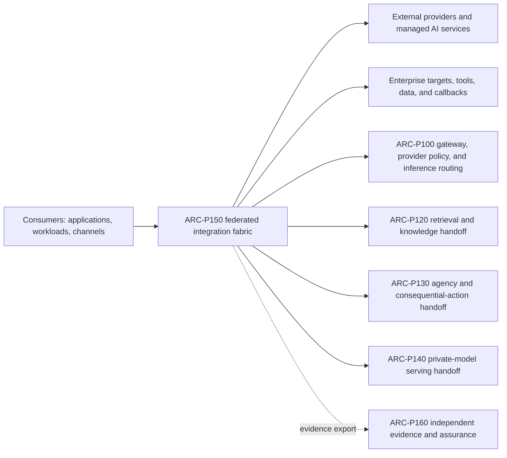
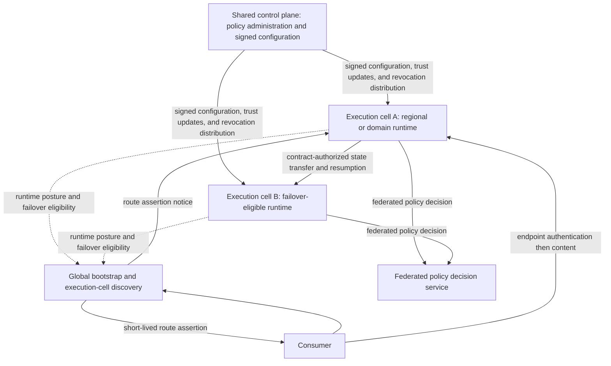
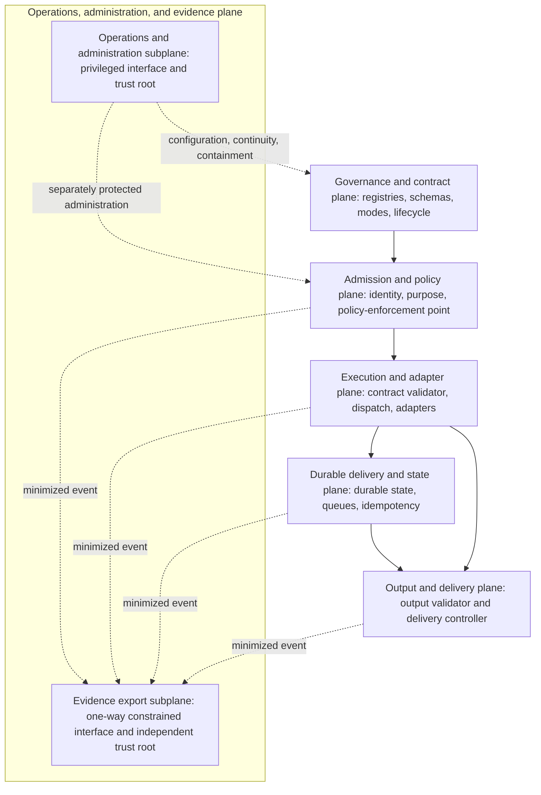
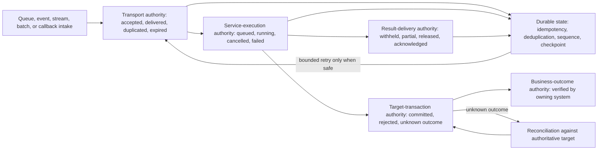
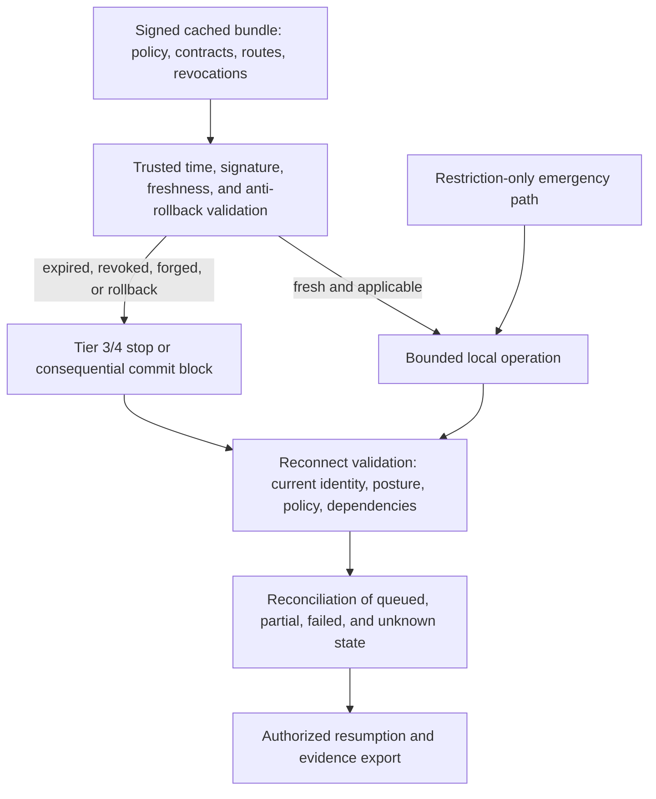
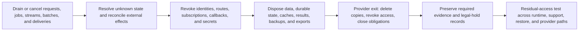

# ARC-P150 AI integration services

## Metadata

**Pattern ID:** ARC-P150

**Status:** Draft

**Version:** 0.1.0

| Field | Value |
|---|---|
| Owner | Enterprise Architecture |
| Required reviewers | Application Architecture, API Architecture, Integration Architecture, Identity and Access Management, Data Governance, Model Governance, Security Architecture, Operations, Business Continuity, Privacy, Legal, Third-Party Risk, Records Management, Assurance |
| Approval date | Not approved (Draft) |
| Review date | Before approval; then at the organization-defined architecture review interval |
| Pillars | Protect AI, Utilize AI, Govern AI |
| Lifecycle stages | Strategy, Architecture, Development, Validation, Approval, Deployment, Operations, Monitoring, Continuous improvement, Retirement |
| Capability tiers | Tier 1 through Tier 4; isolated Tier 0 experimentation |
| Deployment models | Centralized, federated, regional, sovereign, high-assurance, edge, thin synchronous, durable workflow, external-managed |
| Primary pattern role | Primary AI integration services pattern |
| Supersedes | None |

## Purpose

Define a governed, reusable integration boundary for embedding AI capabilities into enterprise applications. The pattern standardizes stable capability-level contracts, identity and policy propagation, deterministic service dispatch, protocol adaptation, delivery semantics, state, compatibility, resilience, evidence, and lifecycle across synchronous, asynchronous, streaming, batch, event or subscription, and callback interactions. It prevents consuming applications from integrating directly and inconsistently with model providers, private inference, enterprise knowledge, tools, targets, or external AI services.

## Problem statement

Enterprise applications otherwise integrate with AI capabilities through inconsistent provider interfaces, identity mappings, schemas, protocols, retry behavior, state models, and evidence paths. Those differences obscure business purpose and authorization, allow adapters to broaden authority or data use, conflate transport success with business outcome, create fragile provider dependencies, and make isolation, recovery, compatibility, and retirement difficult to assess consistently.

## Intended outcomes

- Stable, reusable service contracts replace raw provider-specific interfaces.
- Authoritative identity, tenant, purpose, classification, provenance, policy, and correlation survive every hop.
- All six interaction modes use explicit and consistent delivery semantics.
- Consumer, tenant, job, stream, batch, callback, cache, queue, result, and support state remain isolated.
- Adapters cannot broaden data access, provider choice, target scope, action authority, or credential use.
- Transport, execution, inference, target, and business outcomes remain distinct and reconcilable.
- Regional isolation, data locality, independent scaling, bounded degradation, and controlled recovery are supported.
- Compatibility, portability, deprecation, and retirement are testable.
- Independently assessable evidence is available without unnecessary copying of sensitive content.

## Non-goals

This pattern does not define a universal enterprise service bus, raw provider proxy, generic arbitrary-execution API, business-specific workflow, AI gateway replacement, retrieval ingestion shortcut, agent authorization service, MCP trust proxy, model-management interface, or authoritative observability store. It does not replace conventional API management, service mesh, messaging, workflow, ETL, transaction, software supply-chain, or target-native authorization controls, and it does not claim that delivery success proves output correctness or business completion. Product selection and external-standard mappings remain outside this pattern.

## Applicability

Use this pattern when enterprise applications consume reusable AI services through synchronous requests, asynchronous jobs, streams, batches or files, events or subscriptions, or callbacks. It applies to Tier 1 through Tier 4 capabilities and to isolated Tier 0 experimentation when the experiment cannot connect to production authority or data. It supports centralized, federated, regional, sovereign, high-assurance, edge, thin synchronous, durable-workflow, and externally managed deployments. ARC-P150 may execute deterministic, pre-authorized service workflows; ARC-P130 is mandatory when AI selects a tool, target, operation, or materially consequential parameters, expands delegated authority, or initiates consequential action.

## Assumptions and prerequisites

The consuming capability has an accountable owner, approved business purpose, use-case authorization, human-oversight decision, data classification, capability tier, lifecycle state, and downstream-use rules. Enterprise identity, policy, secrets, contract and schema governance, target-native authorization, records, continuity, supplier-risk, and evidence services are available or their inherited outcomes are explicitly verified. Applicable ARC-P100, ARC-P120, ARC-P130, ARC-P140, and ARC-P160 responsibilities remain authoritative, and the consuming capability retains accountability for output use and downstream effects.

## Prohibited uses

The pattern shall not expose raw provider interfaces or arbitrary execution as an enterprise contract; treat model output, prompt content, transport metadata, an agent lease, or discovery results as authority; let adapters select unapproved providers, targets, operations, or credentials; claim exactly-once business effects from transport behavior; or represent transport, callback, queue, trace, or model success as a verified business outcome. It shall not bypass applicable AI gateway, retrieval, agency, private-model, target-native authorization, or independent-evidence requirements, and it shall not support a deployment that cannot preserve tenant isolation, bounded authority, safe failure, reconciliation, and retirement.

## Architecture views

### Figure 1. Context and pattern relationships



ARC-P150 owns stable service contracts, admission, deterministic dispatch, interaction-mode delivery, state, and reconciliation. Consumers retain business-purpose and output-use accountability; providers and enterprise targets retain their native authorization and outcome authority; the named supporting patterns retain their defined responsibilities.

### Figure 2. Federated topology



The shared control plane is not a mandatory application-content path. Global discovery selects only registered cells from server-derived region, domain, tenant, capability, capacity, locality, continuity, and policy context. The consumer verifies the purpose-, audience-, tenant-, capability-, region-, endpoint-, version-, expiry-, and nonce-bound route assertion and authenticates the selected cell endpoint before releasing credentials or content. Each cell then authenticates the consumer, verifies its own current runtime posture, and performs local admission. Expired, forged, inconsistent, revoked, or nonconformant cells are quarantined and excluded from new work, secret use, and failover.

### Figure 3. Six-plane component view



The logical planes may be deployed in different services, but their decisions and retained responsibilities remain distinct. The administration and evidence-export subplanes use different identities, interfaces, trust roots, authorization, stores, administrators, and failure dependencies. Evidence access grants no configuration, secret, replay, suspension, or workload authority, and runtime administrators cannot alter authoritative ARC-P160 evidence.

### Figure 4. Normative flow

```mermaid
sequenceDiagram
  participant C as Consumer
  participant B as Global bootstrap
  participant A as Local admission and policy-enforcement point
  participant V as Contract validator
  participant D as Durable state and deterministic dispatcher
  participant S as ARC-P100 / ARC-P120 / ARC-P130 / ARC-P140 handoff
  participant O as Output validator and delivery
  participant E as ARC-P160 evidence export
  C->>B: Bootstrap with non-content routing context
  B-->>C: Signed route assertion
  C->>A: Authenticate selected endpoint and present invocation
  A->>A: Endpoint authentication and local admission
  A->>V: Authorized canonical envelope
  V->>D: Valid contract; durable acceptance when required
  D->>S: Deterministic dispatch and supporting-pattern handoff
  S-->>D: Result or explicit unknown outcome
  D->>D: Conditional reconciliation until claim is supportable
  D->>O: Candidate result and authoritative state
  O-->>C: Validated, authorized, mode-specific delivery
  A-->>E: Admission and authorization evidence
  V-->>E: Validation evidence
  D-->>E: Acceptance, dispatch, transition, failure, and recovery evidence
  O-->>E: Delivery and reconciliation evidence
```

Evidence is cross-cutting from admission through recovery, not a terminal logging step. Authorization is current at every applicable durable, delivery, or consequential step, and no later transport or business result retroactively justifies an earlier decision.

### Figure 5. State and durable-delivery view



Transport, service execution, result delivery, target transaction, and business outcome are separate state authorities. At-least-once queue and event delivery, stream resume, batch manifests, and callback retries require tenant-bound idempotency and deduplication. An acknowledgment or successful transport never proves target commit or business outcome; unknown state is recorded and reconciled before a success claim or retry that could duplicate an effect.

### Figure 6. Degraded operation and recovery



Disconnected operation cannot add routes, providers, credentials, exceptions, scope, or authority. Emergency changes may only restrict operation. Higher-risk work stops, or blocks immediately before commit, when current trust, required evidence, trusted time, capacity, or reconciliation authority is unavailable. Reconnect does not imply recovery: current validation and reconciliation precede authorized resumption.

### Figure 7. Retirement



Retirement is complete only after disposition is recorded for in-flight work and every replica, credential, route, subscription, callback, result, provider copy, support path, and restoration path. Preserved evidence remains protected and attributable without preserving unnecessary workload content.

## Actors and identities

Human users and approvers, consumer applications, workload instances, execution cells, integration services, adapters, providers, brokers, callback senders and receivers, enterprise targets, support personnel, administrators, emergency operators, configuration approvers, signers, trust-root administrators, distributors, and evidence services shall have distinct, inventoried, owned, authenticated, scoped, rotated, revoked, and evidenced identities. In particular, human, service, workload, cell, adapter, provider, broker, callback, target, and administrator identities are separate identity classes and cannot be substituted for one another. Shared integration credentials are prohibited except under a documented legacy exception with equivalent attribution and isolation.

Delegation and token exchange cannot increase scope, audience, lifetime, impersonation, purpose, tenant, provider, model, data, tool, target, operation, or administrative authority. Authorization is re-evaluated at admission, durable acceptance, dequeue, dispatch, batch and per-item execution or delivery, stream frame or partial-result release, event publication, subscription and callback delivery, result release, replay or backfill, and immediately before consequential commit as applicable. Long-lived work uses bounded authorization leases with periodic and event-driven revalidation.

Provider and target credentials remain outside requests, prompts, events, files, logs, traces, dead-letter records, and model context. They are scoped to provider or target, capability, tenant or approved sharing context, environment, purpose, operation, and lifetime. Policy approval, configuration signing, trust-root administration, distribution, runtime administration, evidence custody, and emergency action are separated; higher tiers use dual or threshold control where required. Administrative and emergency credentials use separate privileged workflows, automatic expiry, and review.

## Data and instruction flows

Every interaction shall use a typed, versioned canonical base envelope. Its contract marks every field as required, optional, prohibited, server-issued, consumer-supplied, or derived for each operation and interaction mode. It binds server-validated consumer and workload identity; user identity and explicit delegation when applicable; tenant, capability, purpose, operation, service version, contract version, and mode; data and instruction classification, provenance, residency, retention, and permitted use; correlation ID, causation ID, server-issued request ID, deadline (or an explicit prohibition on no deadline), expiry, budgets, limits, requested response contract, and trace context. Caller-provided identity, tenant, purpose, role, classification, correlation, callback, or authorization fields remain untrusted claims until bound to authenticated context and policy.

Mode extensions are versioned parts of that envelope. Durable submissions require a job ID and idempotency key; streams require a stream ID, sequence scope, frame identity, and resume policy; batches require manifest and item identities; events require an immutable event ID, deduplication scope, producer-stream or partition sequence, subject, and retention policy; and callbacks or subscriptions require a registered destination or subscription reference and allowed event types. Canonicalization rules define duplicate-key handling, encodings, polymorphism, numeric limits, unknown fields, content types, normalization, signatures, and hash calculation. Data, instructions, provider responses, callback content, metadata, and model output remain untrusted and cannot become policy, route, target, query, command, credential reference, system instruction, or authorization.

### Synchronous request and response

The synchronous contract defines bounded payloads; a deadline budget across every hop; cancellation intent; resource, cost, and rate limits; idempotency classification and retry eligibility; response schema; secure errors; and terminal status. A timeout is an unknown outcome unless authoritative service or target state proves failure or success. Failover preserves provider, model, region, residency, retention, training-use, safety, behavior, and assurance constraints.

### Asynchronous jobs and queues

Durable acceptance atomically records a server-issued job ID, immutable request or digest, identity, tenant, purpose, contract and policy version, authorization basis, idempotency key, expiry, budgets, input references, callback and result policy, and correlation. Submit, execute, cancel, inspect-status, read-result, replay, and administration permissions are distinct and current authorization is re-evaluated at each applicable step. Execution states are accepted, queued, running, succeeded, failed, canceled, expired, and unknown; they make no target-transaction or business-outcome claim. Dequeue and redispatch require current authorization and revocation checks, and dead-letter replay is a new governed operation rather than automatic continuation.

### Streaming

Streams authenticate the session and validate every frame or chunk. Each frame binds stream, sequence, tenant, capability, contract, and classification. Contracts bound buffers, backpressure, idle and total duration, frame and message size, rate, cost, fair use, cancellation, reconnect, and resume-token use, and detect truncation, injection, replay, reordering, cross-stream mixing, slow-consumer exhaustion, and resume-token theft. A disconnect proves neither cancellation nor failure; partial output is labeled and cannot cross a delivery boundary before validation appropriate to its structure, content, sensitivity, and use.

Stream authorization uses a bounded authorization lease, revalidated periodically, on material identity, tenant, purpose, classification, policy, contract, route, provider, model, revocation, risk, or destination change, and before release of a frame whose basis changed. Expired or revoked authority stops new execution and delivery, disposes queued frames as contracted, invalidates resume authorization, and requires new authenticated admission; stop, redaction, disposition, reconnect, and evidence decisions are explicit.

### Batch and file processing

A versioned batch manifest binds the input snapshot or digest, source, item count, per-item identity, tenant, classification, schema, region, expiry, output destination, and partial-success policy. Every item is independently validated and authorized; a batch envelope alone is insufficient. Mixed-tenant or mixed-classification batches are prohibited unless independent isolation and evidence are demonstrated. Controls cover archive, formula, path, active-content, parser, decompression, malformed-item, temporary-file, staging, checkpoint, restart, export, and deletion risks, and aggregate success cannot hide unauthorized, quarantined, failed, or unknown items.

Long-running batches use bounded authorization leases at both batch and per-item scope. They are revalidated periodically, on material identity, tenant, purpose, classification, policy, contract, route, provider, model, target, region, destination, or revocation change, and before item execution and result delivery. Expired or revoked authority stops or quarantines affected items according to contract without being hidden by aggregate status.

### Events and subscriptions

Every event uses a versioned envelope with immutable event ID and deduplication scope; authenticated producer; purpose, provenance, classification, schema, tenant, correlation, causation, trusted or bounded time, expiry, and integrity; and a sequence scoped explicitly to a producer stream, partition, subject, or subscription rather than global order. Contracts define gap detection, wait, skip, quarantine, backfill, and authoritative reconciliation policy and disposition duplicate, replayed, out-of-order, late, conflicting, expired, and poison events. Event content, topic, headers, queue metadata, and correlation IDs confer no authority.

Granular event permissions are separate for publish, topic discovery, subscribe, consume, acknowledge, checkpoint, replay, backfill, consumer-group membership, retained-event access, wildcard or pattern subscription, and topic or subscription administration. Subscription bounded authorization leases receive periodic and event-driven revalidation. Revocation stops new delivery, prevents backlog and retained-event access, invalidates replay and checkpoint authority, governs queued events, and records consumer-group and wildcard changes.

### Callbacks and webhooks

Callback destinations and event types are pre-registered, ownership-verified, tenant-bound, purpose-bound, classification-approved, and assigned an internal or external destination class. Request-selected or model-generated callback URLs are prohibited; arbitrary and private-address destinations are denied by default. Registered internal enterprise destinations may use approved private addressing only through controlled name resolution, egress, routing, network policy, destination identity, and change monitoring. Delivery prevents SSRF, open redirects, DNS rebinding, credential forwarding, and unapproved cross-border or data-class transfer.

Inbound callbacks require authenticated transport and a message-level signature, trusted-time window, nonce and replay cache, audience, content digest, provider and job binding, schema, expected state transition, and key-rotation handling. Approved signing trust uses purpose- and algorithm-restricted provider- and tenant-scoped keys, rotation overlap, compromise epochs, revocation, and defined safe behavior when key-status or replay-cache services are unavailable. Post-compromise receipt of a pre-compromise signature is rejected or quarantined under the incident rule. Retry and backoff are bounded; callback acknowledgment proves delivery only, while authoritative job or target status governs business outcome.

## Trust boundaries

Each material crossing records the following minimum allocation. Deployment records add concrete endpoints, owners, data classes, residency, retention, thresholds, and approved exceptions.

| Direction and purpose | Identities | Authorization | Information | Validation | Protection | Evidence | Reliability | Retained responsibility |
|---|---|---|---|---|---|---|---|---|
| Consumer -> global bootstrap: cell discovery | Consumer workload; bootstrap service | Registered tenant, capability, purpose, and allowed region; no content authority | Non-content tenant, capability, locality, continuity context | Authenticate caller; derive server-side context; reject replay | TLS; minimized metadata; no provider credentials | Request, decision, eligible-set version | Short deadline; no silent fallback | Consumer retains invocation purpose; bootstrap owns registered-cell selection only |
| Bootstrap -> consumer and selected cell: signed routing | Bootstrap signer; consumer; cell | Purpose-, audience-, tenant-, capability-, region-, endpoint-bound route | Route assertion, version, expiry, nonce, selected endpoint | Verify issuer, signature, time, replay defense, consumer verification, endpoint identity | Purpose-bound signing keys; short lifetime | Assertion, issuer, verification, endpoint | Expiry and retry bounds; fail closed | Consumer authenticates selected cell; cell repeats local admission |
| Shared control plane -> cell: distribution | Publisher; distributor; execution-cell workload | Approved signer, artifact purpose, cell applicability, revocation epoch | Signed contracts, policy, routes, trust updates, revocations, restrictions | Signature, configuration identity, version, freshness, revocation, anti-rollback, split-brain | HSM-equivalent custody; encrypted channel and store; separation of duties | Approval, signature, receipt, activation, rejection | Bounded propagation; stale or conflicting state quarantines cell | Shared plane owns approved artifacts; cell owns verify-before-use |
| Cell -> federated PDP: policy decision | Cell workload; PDP service | Registered cell may request only contract-defined decisions | Bound identity, tenant, purpose, capability, operation, classification, policy version | Mutual authentication; schema, freshness, context, decision integrity | Encrypted channel; minimized attributes; no credential forwarding | Request correlation, policy version, decision, expiry | Deadline; cached decisions only when explicitly permitted | Cell retains enforcement and safe-state responsibility |
| Source cell -> destination cell: failover or resumption | Source and destination cell workloads; transfer controller | Contract-defined eligible cells, state classes, and resumption authority | Tenant-bound state, manifest, checkpoint, idempotency and reconciliation status | Both cell postures, route assertion, integrity, freshness, completeness, unknown-state check | Encrypted transfer; tenant isolation; immutable manifest | Initiator, approvals, state hash, acceptance, outcome | Ordered checkpoint; no resumption on partial transfer | Source owns transfer truth; destination reauthorizes and reconciles before execution |
| Z1 consumer -> Z2 cell: admission | Consumer and workload; cell ingress | Current identity, delegation, purpose, capability, contract, limits | Canonical invocation envelope and untrusted content | Endpoint and consumer authentication; delegation, schema, provenance, classification, replay | TLS; tenant isolation; bounded buffers; secret exclusion | Admission, policy, validation, denial | Deadline, quota, rate and capacity bounds | Consumer retains input and use accountability; cell owns admission |
| Z2 admission -> Z3 execution: dispatch | Policy-enforcement point; service runtime; adapter | Explicit operation, contract, policy, provider or target constraints | Canonical envelope, decision, expiry, correlation, budgets | Decision freshness, contract version, adapter allowlist, cell posture | Workload identity; scoped secrets client; isolated state | Decision, dispatcher, adapter, transition | Bounded queue, retry, cancellation and expiry | Dispatcher cannot broaden authorization; runtime owns deterministic execution |
| Z2/Z3 -> Z4 inference | Cell service or adapter; ARC-P100 enforcement point; provider | Approved model/provider route, data class, purpose and budget | Minimized inference request, policy context, correlation | Contract and content checks; ARC-P100 routing and provider controls | Scoped provider credential outside content; encryption and tenant isolation | Request lineage, route, model, provider, result status | Timeout, rate, retry only when safe; unknown status explicit | ARC-P100 owns inference routing; cell owns service contract and outcome interpretation |
| Z2/Z3 -> Z5 retrieval | Cell service; ARC-P120 retrieval service | Approved sources, tenant, purpose, query and result scope | Query, classification, provenance requirements, correlation | Source admission, retrieval authorization, grounding and citation checks | Scoped workload identity; minimized query; residency enforcement | Query lineage, sources, policy, retrieval result | Timeout, freshness and partial-result policy | ARC-P120 owns knowledge lifecycle; cell owns service delivery |
| Z2/Z3 -> Z6 tool or target | Cell service or ARC-P130 agent; target identity | Pre-authorized deterministic operation, or ARC-P130 lease and approval | Typed command, bounded parameters, idempotency key, correlation | Target-native authorization; schema; current commit authorization; output validation | Target-scoped credential; encrypted channel; no model-derived authority | Request, target decision, transaction state, reconciliation | Bounded retry; unknown outcomes block blind replay | Target owns transaction truth; ARC-P130 owns AI-selected action; consumer owns business outcome |
| Z0 callback/event -> Z2 cell | Provider, callback sender, event source; cell broker | Registered source, event type, tenant, subscription, window | Untrusted callback or event, source ID, sequence, signature | Source authentication, signature, schema, freshness, replay, tenant binding | Dedicated ingress; rate limits; quarantine; secret-safe dead letter | Source, receipt, duplicate, disposition | At-least-once handling; deduplicate and order per contract | Sender owns event assertion; cell owns admission and processing |
| Z2/Z3 -> Z0 callback destination | Delivery controller; registered callback receiver | Current registration, tenant, event type, destination and delivery lease | Validated minimized result, labels, correlation, delivery ID | Destination authentication; output policy; registration and lease freshness | Destination-scoped credential; encryption; no sensitive query-string data | Attempt, receipt, retry, expiry, terminal status | Bounded retry, idempotency, dead-letter quarantine | Receiver owns business processing; cell owns delivery state only |
| Execution cell -> broker/queue | Cell workload; broker identity; worker | Tenant, topic or queue, operation, retention, producer and consumer scope | Canonical job/event, state reference, sequence, expiry | Broker ACL, schema, integrity, tenant, duplicate and poison-message checks | Encryption; isolated topics and stores; scoped credentials | Publish, durable receipt, dequeue, ack, quarantine | At-least-once; capacity, ordering, timeout, retry and expiry bounds | Broker owns transport state; cell owns service and reconciliation state |
| Z2/Z3 -> Z7 evidence | Runtime component; evidence exporter; ARC-P160 collector | One-way or equivalently constrained event submission only | Minimized attributable events, decisions, gaps, outcomes, timestamps | Source identity, schema, correlation, tenant, integrity, occurrence and receipt time | Separate trust root, interface, store, identity and failure dependency | Durable receipt, sequence, gap and backfill status | Bounded buffer/backfill; Tier 3/4 safe stop on required-evidence loss | ARC-P160 owns authoritative custody; runtime cannot alter accepted evidence |
| Z7 -> Z2/Z3 administration and containment | Named administrator or containment service; cell admin endpoint | Separate privileged workflow, approved change, bounded scope and expiry | Signed configuration command, suspension, recovery or restriction | Strong authentication; dual control where required; target and change validation | Separate administration path, credentials, trust root and audit store | Request, approval, command, acknowledgment, effect, rollback | Restriction-first failure; timeout and recovery procedure | Administrators cannot rewrite evidence or create unmonitored replay/workload paths |

Queue storage and delivery remain logical boundaries even when physically co-located, and contracted external services remain external. Global cell discovery is distinct from cell-local capability discovery: the latter may resolve only services allowed by the verified routing assertion and cannot register or select a cell, weaken a contract, or expand authority. Operations and evidence paths are separately protected from workload paths and from each other.

## Components and responsibilities

The **governance and contract plane** maintains service and consumer registries; ownership and purpose; versioned contracts, canonicalization, schemas, events, callbacks, and subscriptions; allowed interaction modes; classifications, residency, dependencies, SLOs, quotas, compatibility, deprecation, exceptions, review state, cell conformance, and signed configuration history.

The **admission and policy plane** provides global bootstrap and registered-cell discovery, cell ingress, endpoint and consumer authentication, delegation verification, identity and tenant derivation, purpose and capability binding, policy enforcement, limit and replay control, classification and provenance checks, approved contract resolution, route-assertion verification, selected-cell endpoint authentication, runtime cell-posture verification, and failover exclusion. Global discovery does not carry application content; cell-local capability discovery cannot expand the global routing assertion.

The **execution and adapter plane** contains the contract validator and canonicalizer, dispatcher, bounded deterministic service runtime, protocol adapters, and secrets client. Adapters preserve identity, purpose, tenant, classification, provenance, expiry, policy version, and correlation and cannot hide provider routing, business authorization, agent planning, target authority, or credential selection. ARC-P100 governs shared inference admission, routing, provider policy, and credentials; ARC-P120 governs retrieval; ARC-P130 governs AI-selected tools, targets, parameters, and consequential action; ARC-P140 governs enterprise-operated model lifecycle and serving.

The **durable delivery and state plane** provides durable job and idempotency stores, queue and event adapters, stream relays, batch coordinators and immutable manifests, callback and subscription brokers, deduplication, sequencing, checkpointing, cancellation, result expiry, dead-letter quarantine, explicit unknown-outcome handling, and authoritative reconciliation. It keeps transport, service execution, result delivery, target transaction, and business outcome separate and never claims exactly-once business effects from transport behavior.

The **output and delivery plane** contains the output validator and delivery controller. It validates, classifies, labels, minimizes, and authorizes outputs before synchronous response, stream or partial-result release, persistence, event publication, batch export, callback delivery, or downstream machine use. It preserves per-item and partial status and blocks delivery until every reconciliation required by the claimed result is complete.

The **operations, administration, and evidence plane** contains explicitly isolated operations-and-administration and evidence-export subplanes. Operations provides separately protected configuration, secrets, privileged administration, capacity, continuity, emergency suspension, recovery, compatibility and conformance testing, and provider-gap handling. Evidence export uses a one-way or equivalently constrained path to send minimized attributable admission-through-recovery events to ARC-P160. The two subplanes have distinct identities, interfaces, trust roots, authorization, stores, administrators, and failure dependencies; evidence access cannot confer configuration, secret, replay, suspension, or workload authority, and operations administrators cannot alter authoritative evidence.

Each regional or domain execution cell has a unique workload identity, accountable owner, region or domain, approved protocol profile, software and configuration identity, current conformance evidence, capacity limits, lifecycle state, and freshness-bounded runtime attestation or equivalent release-closure posture. The shared control plane distributes signed, versioned, bounded-lifetime configuration and restrictions but need not process application content. Cells verify identity, signature, purpose, version, freshness, revocation epoch, applicability, trusted time, and anti-rollback state before use and cannot create registrations, invent exceptions, silently downgrade versions, or retain failover eligibility after posture becomes invalid.

## Required controls

Each implementation shall allocate all applicable ESAF-1100 controls as required, inherited-and-verified, or conditional without overlap. The control record identifies implementation location, the catalog-accountable owner, evidence owner, inheritance source and limitations, conditional trigger, freshness, failure dependency, retained responsibility, exception state, and assessment result.

## Control points and overlays

Deployments shall implement and evidence the approved CP1 through CP15 control points for governance, registration, admission, contract validation, context binding, isolation, dispatch, durable state, inference, data and retrieval, tool and target handoff, output delivery, external boundaries, evidence export, recovery, compatibility, and retirement. Applicable security, privacy, resilience, deployment, risk, jurisdiction, supplier, records, and assurance overlays shall strengthen rather than weaken the baseline.

## Architecture decisions and parameters

The baseline is a contract-first federated integration fabric with a shared policy-administration and configuration plane and conformant regional or domain execution cells. Durable work assumes at-least-once transport, idempotency, deduplication, bounded retry, explicit unknown outcomes, and authoritative reconciliation; transport behavior never establishes exactly-once business effects. Deployments define limits, deadlines, leases, freshness, retention, compatibility windows, recovery objectives, review cadence, and accountable approval authorities.

### Identity, authorization, and data lifecycle

Delegated token exchange cannot increase scope, audience, lifetime, impersonation, provider, model, data, tool, target, or administrative authority. Current authorization is evaluated at admission, durable acceptance, dequeue, dispatch, batch and per-item execution or delivery, stream frame or partial-result release, event publication and subscription delivery, callback delivery, result release, replay or backfill, and immediately before consequential commit as applicable. Queued jobs, streams, batches, subscriptions, callbacks, result release, replay, and consequential commit use bounded authorization leases or equivalently bounded current decisions; revocation stops new work and delivery and explicitly stops, redacts, quarantines, discards, or reconciles in-flight work under contract.

The fabric preserves data and instruction classification, provenance, purpose, authorization, residency, retention, deletion, legal hold, and permitted output use across transformations. Tenant isolation covers request buffers, sessions, caches, idempotency records, job stores, queues, topics, streams, resume tokens, batch manifests, staging, temporary files, callbacks, result stores, dead-letter queues, exports, metrics, traces, tickets, backups, support access, and administrative tools. Cache, coalescing, and idempotency scope binds tenant, authoritative identity or approved sharing scope, purpose, contract and policy version, classification, provider or target constraints, and lifecycle state.

Deletion, revocation, tenant offboarding, contract withdrawal, policy change, and retirement propagate to active streams, in-flight requests, queued work, batches, event backlogs, subscriptions, callbacks, caches, results, exports, backups, and provider-held copies according to recorded obligations. Every contract records whether affected in-flight data is stopped, redacted, quarantined, discarded, reconciled, or preserved under legal hold. Provider and target secrets stay outside requests, prompts, events, files, logs, traces, dead-letter records, and model context and are scoped to provider or target, capability, tenant or approved sharing scope, environment, purpose, operation, and lifetime.

### Contract, adapter, and output semantics

Every protocol transformation has a field-level semantic map and loss policy. Unsupported or lossy transformation of identity, tenant, purpose, classification, provenance, expiry, delegation, policy or authorization version, cancellation, sequence, idempotency, or unknown-state information blocks the path unless an explicit approved transformation and downstream representation preserve the semantic requirement. Adapters cannot silently drop, truncate, default, duplicate, reinterpret, synthesize, or approximate authoritative fields. Contract and adapter changes test both producer and consumer directions; unknown fields, schema downgrade, content-type changes, provider drift, and connector retry, logging, retention, residency, or authentication changes cannot be accepted silently.

AI output is untrusted data. Before presentation, execution, persistence, publication, callback, export, or machine use, the service validates structure, type, size, encoding, classification, sensitivity, provenance, destination, permitted use, uncertainty, and action implications. ARC-P130 applies when AI-selected output is used to invoke, execute, persist, route, or otherwise determine material effect through an endpoint, method, tool, query, command, file path, callback URL, credential reference, or business object; authorized human display alone does not invoke ARC-P130, though validation, disclosure, and downstream-use controls still apply. Structured output is validated in full before machine use, partial output is never represented as complete or safe, and result access is reauthorized against job, consumer, tenant, purpose, destination, contract, and retention.

### Orthogonal state authorities and reconciliation

The following state machines are orthogonal. Their named owner is the authoritative writer; contracts grant only defined readers and transition authorities, enumerate allowed transitions, terminal states, guards, cancellation races, and restart behavior, and never project a state into another machine without authoritative evidence.

| State machine | Approved states | Owner and transition authority |
|---|---|---|
| Transport delivery | pending, accepted, delivered, acknowledged, expired, dead-lettered, unknown | Integration transport; only its authorized adapter or broker writes delivery transitions. |
| Service execution | accepted, queued, running, succeeded, failed, canceled, expired, unknown | Reusable AI service; only its execution controller writes service transitions. |
| Result delivery | pending, available, partially delivered, delivered, revoked, expired, unknown | Delivery controller; only it writes release and delivery transitions. |
| Target transaction | not applicable, prepared, committed, rejected, compensated, unknown | Target system; target-native authority writes transaction truth, governed by ARC-P130 when applicable. |
| Business outcome | not assessed, achieved, partially achieved, not achieved, unknown | Consuming capability or accountable business process; only its authorized outcome authority writes the assessment. |

Contradictions never resolve by timestamp or transport success alone. The contract defines precedence among authoritative sources, correction authority, and reconciliation procedure; an unresolvable contradiction remains unknown, blocks unsupported success claims and unsafe retry, and is evidenced until authoritative reconciliation completes. A timeout, disconnect, lost acknowledgment, worker crash, missing callback, contradictory provider response, or evidence gap similarly remains unknown until resolved; non-idempotent unknown work is not blindly retried.

Stateful-mode projections are bounded and do not prove target transaction or business outcome. Streams use created, open, draining, closed, canceled, expired, and unknown, authored by the stream relay. Batches record batch and per-item execution through the batch coordinator and per-item delivery through the delivery controller. Events record publication through the event adapter and per-subscription delivery or checkpoint through the subscription broker. Callbacks use pending, attempted, acknowledged, exhausted, canceled, and unknown, authored by the callback broker.

Idempotency keys bind authoritative caller, tenant, purpose, operation, contract, policy or authorization version, classification, normalized input or digest, output destination, approved provider, model, target, region, lifecycle state, and expiry. Concurrent use, changed payload, cross-tenant reuse, expired replay, or key-store failure is rejected or reconciled safely. A material change to any bound basis invalidates the record or requires explicit reauthorization and reconciliation before releasing an earlier result. Retries are limited to proven-idempotent operations or target-native idempotency with authoritative reconciliation.

### Signing trust lifecycles

Configuration-signing trust uses an enterprise-approved configuration issuer whose keys are held in hardware-backed or equivalently protected custody and whose certificates and signatures are purpose-constrained to named configuration, contract, policy, route, cell-conformance, exception, revocation, or emergency-restriction artifact classes. Policy and configuration approval, artifact construction, signing, trust-root administration, distribution, runtime administration, and evidence custody use separate identities, interfaces, permissions, and audit records. Tier 3 and Tier 4 issuances, trust-root changes, compromise declarations, and emergency recovery use dual or threshold control at the organization-defined quorum; no runtime, distributor, or sole approver can satisfy that threshold.

The configuration-signing trust profile records algorithm and parameter identifiers, accepted and prohibited suites, verification behavior, key and certificate validity, rotation overlap, signer and trust-root versions, revocation sources and freshness, and an algorithm-agility migration procedure. Rotation introduces a separately approved successor, distributes and confirms trust before use, bounds overlap, re-signs still-authorized artifacts when required, and removes predecessor trust after verification. A suspected compromise creates a monotonically increasing compromise epoch, revokes affected issuers and keys, blocks artifacts issued in or after the affected interval until adjudicated, and requires governed trust restoration. The incident record determines the disposition of every pre-compromise artifact: reject, quarantine, independently revalidate and re-sign, or retain only under an explicit bounded exception. Merely restoring a key or rolling back configuration cannot restore trust.

Callback-signing trust has an equivalent lifecycle for outbound callback signers and approved inbound callback issuers: protected issuer and key custody; callback-only purpose constraints; separation of registration approval, signing, trust administration, distribution, callback runtime, and evidence; higher-tier dual or threshold control; algorithm agility; scheduled and emergency rotation; compromise epoch and revocation; re-signing where meaningful; and explicit disposition of pre-compromise signatures and artifacts. Callback verification binds signer and current key status to audience, destination registration, tenant, job, event, payload digest, timestamp, nonce, attempt, and expiry. A valid historic signature received after its signer or compromise epoch is revoked is not accepted merely because it was created earlier.

### Trusted time, isolation, and restriction

Trusted time decisions use approved authenticated or signed time sources and record source, synchronization quality, maximum uncertainty, and observation time. Each cell maintains monotonic counters or equivalent anti-rollback state for configuration sequence, compromise and revocation epoch, replay windows, and other lifetime decisions. Contracts define explicit safe behavior for clock skew, rollback, leap, excessive uncertainty, source disagreement, and time-source loss. An unavailable or untrusted clock cannot extend a bundle, credential, route, provider, tenant, authorization, callback, replay, lease, or result lifetime; Tier 3 and Tier 4 work stops when time uncertainty exceeds the applicable bound.

Emergency suspension and revocation use a separately protected out-of-band restriction path or a restriction-only cell-local containment authority that can reduce scope, stop work, revoke local trust, or shut down but cannot grant access, add routes, extend lifetimes, resume work, or alter evidence. If neither mechanism is feasible, the approved risk record sets a maximum isolation window no longer than the shortest relevant bundle, credential, route, provider, tenant, or authorization lifetime. Conflicting emergency commands resolve to the more restrictive state, emit independent evidence through every available protected path, and require governed recovery and explicit resumption authority.

## Failure modes and abuse cases

Each deployment shall maintain a failure-and-abuse treatment record for every material mode, abuse case, negative test, and combination relevant to its implementation. Every record contains the initiating condition or adversary capability; affected boundary and state machines; detection signal and maximum detection interval; containment action and safe state; recovery and resumption authority; authoritative reconciliation source; required evidence; residual risk; tier applicability; and retest trigger. A summary label does not replace a treatment for distinct boundaries, state authorities, tiers, or safe states.

The inventory shall include, at minimum:

- forged identity, delegation, audience, scope, purpose, tenant, and classification claims; token substitution; impersonation; cross-tenant request, object, job, callback, resume-token, cache, queue, batch-item, result, dead-letter, export, backup, support, and administrative access; and authorization or revocation change during every durable mode, including queued, streaming, batched, retrying, awaiting callback, subscription delivery, replay, backfill, result release, and consequential commit;
- malicious or unavailable bootstrap; route, routing-assertion, host, redirect, endpoint, audience, tenant, capability, region, version, expiry, downgrade, replay, and failover attacks; wrong-cell substitution; selected-cell endpoint-identity mismatch; cloned, compromised, ineligible, or quarantined cells; stolen or forged cell identity; stale or forged runtime attestation; release-closure mismatch; lateral-secret use from an unapproved runtime; and forged cell evidence;
- duplicate keys, unknown fields, alternate encodings, ambiguous types, numeric overflow, schema downgrade, canonicalization mismatch, wrong content type, oversized nesting, silent contract drift, and semantic loss at gateway, broker, adapter, connector, SDK, callback, and target hops, including dropped, truncated, defaulted, duplicated, reinterpreted, or synthesized identity, tenant, purpose, classification, provenance, expiry, delegation, policy, cancellation, and unknown-outcome metadata;
- direct and indirect prompt or instruction injection through structured fields, files, URLs, headers, event metadata, provider status, callbacks, errors, or target responses, plus model-generated endpoints, methods, tools, queries, commands, paths, credentials, and targets that attempt to select authority, routing, execution, persistence, or material effect;
- duplicate submission; concurrent idempotency use; changed payload; replay after expiry; timeout retry; reordering; late callback; cancellation races; eventual completion after caller timeout; worker crash before or after an effect; broker acknowledgment loss; callback loss; poison messages; dead-letter replay; partial batch; contradictory provider or target state; unknown outcome; blind retry; and false projection among transport, service, result, target, and business state;
- event permission abuse through topic enumeration, wildcard escalation, consumer-group takeover, or unauthorized subscribe, consume, publish, acknowledge, checkpoint, replay, backfill, retained-backlog, or post-revocation access;
- partial-stream disclosure and exhaustion, including frame injection, truncation, cross-stream mixing, resume-token theft, sequence or provenance confusion, slow consumers, connection exhaustion, buffer exhaustion, and release of sensitive or structurally incomplete partial output as safe or complete;
- callback audience, digest, job binding, signer, key-status, replay, redirect, resolution, destination, and error attacks, including invalid signature, timestamp or nonce; compromised callback signer; a pre-compromise signature received after revocation; key-status or replay-cache outage; key rotation; DNS rebinding; unregistered private address; response-size amplification; destination confusion; and error disclosure;
- connector or SDK compromise and rollback, compromised dependencies, expired certificates, revoked secrets, unsupported protocols, changed endpoints, serialization, retry, logging, retention, training use, residency, authentication, output or error behavior, and silent provider response drift;
- mixed-tenant batching; cache-key omission; count or timing leakage; an unauthorized item hidden in an authorized batch; aggregate success masking item failure; retry storms; fan-out explosion; quota evasion; expensive-payload amplification; backpressure propagation; capacity, cost, queue, worker, callback, stream, and result-store exhaustion;
- provider or model outage and failover that changes region, retention, training, safety, schema, behavior, portability, deletion, exit, or assurance; target, broker, transport, callback, stream, batch, event, credential, certificate, policy, state, lifecycle, migration, and recovery failures; and loss of authoritative reconciliation;
- trust and time failures, including forged, wrong-purpose, stale, downgraded, rollback, or split-brain signed configuration; compromised issuer, signer, trust root, distributor, or runtime; key rotation or revocation failure; continued trust in pre-compromise artifacts; clock skew or rollback; time-source loss or disagreement; excessive uncertainty; and acceptance of expired policy, authorization, callback, lease, credential, bundle, route, or replay windows;
- containment failures, including control-plane compromise, partition during emergency containment, conflicting emergency commands, out-of-band restriction-path failure, compromised restriction-only authority, unsafe recovery, unauthorized resumption, and emergency commands that expand rather than restrict authority;
- telemetry and evidence failures, including observability outage, forged trace identifiers, telemetry injection, raw-content or secret leakage, missing or reordered evidence, evidence tampering or forgery, compromised export, attempted replay or action through Z7, administrator interference, loss of independent custody, and unsupported success or assurance claims; and
- retirement failures involving surviving identities, credentials, routes, jobs, schedules, callbacks, subscriptions, queues, replicas, caches, results, exports, backups, restoration paths, support paths, legal-hold copies, or provider-held data, including failed provider exit, deletion, cryptographic disposition, and residual-access detection.

Each treatment is exercised at the applicable boundary and tier with objective, preconditions, exact evidence, pass and fail thresholds, safe-state or escalation, accountable reviewer, and retest trigger. A successful transport response, callback receipt, provider response, or emitted trace is never by itself evidence of authorization, correct model behavior, completed side effect, reconciled state, or verified business outcome.

## Fallback recovery and retirement

Timeouts and dependency failures move work to an explicit failed, stopped, quarantined, or unknown state according to contract. Retries are bounded and limited to proven-idempotent operations or target-native idempotency with authoritative reconciliation. Cached operation is allowed only under an approved mode whose signed contract and policy bundle remains within its purpose, sequence, freshness, revocation, tier, region, service, consumer, provider, target, evidence, capacity, and time-uncertainty bounds. It cannot register services or consumers, create exceptions, expand privileges, add or enable routes, accept new callbacks or subscriptions, select unapproved versions, weaken validation, extend lifetimes, or increase provider, model, data, target, action, tenant, connectivity, or administrative scope. Expiry, rollback, replay, unverifiable signature or trust status, excessive time uncertainty, exhausted capacity or evidence buffers, or a required revocation gap produces the contract's stopped, blocked, quarantined, or unknown safe state.

Tier 3 and Tier 4 activity stops or cannot commit when current identity, tenant binding, authorization, contract integrity, revocation, trusted time, required evidence, or applicable target-outcome assurance is unavailable. Lower tiers may continue only where their tier applicability record approves a non-consequential degraded mode, no authority or data scope expands, status is visible and evidenced, duration and volume remain bounded, and local state cannot silently become authoritative.

Reconnection validates endpoint and cell identity, current runtime posture, bundle purpose, signer and trust status, compromise and revocation epoch, sequence, trusted time, freshness, contract, authorization, dependencies, provider, target, capacity, and evidence continuity. It rejects rollback and replay, then reconciles registrations, routes, revocations, exceptions, credentials, jobs, queues, streams, batches, events, subscriptions, callbacks, results, target transactions, business outcomes, and evidence against each named authoritative reconciliation source. Divergent local state remains non-authoritative, unknown work is not blindly retried, and resumption requires the recorded recovery authority after reconciliation and evidence-gap disposition.

Recovery tests cover worker failure before and after effects, broker acknowledgment loss, callback loss, duplicate and reordered work, cancellation races, queue and result corruption, partial stream and batch, policy and trust outage, time failure, containment and isolation, cell and regional loss, provider and target failure, stale or rolled-back configuration, KMS and credential recovery, backup restoration, capacity exhaustion, evidence outage and backfill, and reconciliation against target-native state. Emergency suspension revokes or disables routes, credentials, trust, registrations, subscriptions, callbacks, queued work, replays, provider access, and privileged sessions according to risk. Resumption requires current authorization, contract, dependency, provider, target, evidence, trust, time, and recovery validation and cannot be inferred from restored connectivity.

Provider exit and retirement drain or cancel work, resolve every unknown outcome, dispose of results and temporary or durable state, remove routes and registrations, revoke identities and credentials, disable subscriptions, callbacks, event sources, scheduled work, replays, and support access, migrate or stop consumers, complete provider exit and verified deletion, preserve only required evidence and legal-hold material, and close contractual obligations. A residual-access retirement search tests former endpoints, identities, secrets, routes, queues, topics, jobs, schedules, callbacks, subscriptions, caches, results, exports, replicas, backups, restoration workflows, support paths, and provider-held copies. Retirement is not complete until exceptions and surviving access are eliminated or explicitly risk-accepted with an owner, expiry, containment, evidence, and retest date.

## Evidence and assessment

The implementation shall retain inventories, architecture and boundary records, versioned contracts, identity and delegation matrices, data lifecycle mappings, signed configuration history, delivery and reconciliation matrices, state records, compatibility and recovery tests, provider-gap records, and a CP1 through CP15 assurance matrix. Minimized, attributable runtime evidence is exported through an independently protected path to ARC-P160. Acceptance tests define objective, precondition, exact evidence, thresholds, safe state, accountable reviewer, and retest trigger.

## Variants and alternatives

Approved variants are a central multi-protocol hub, durable workflow and event backbone, regional or sovereign cells, a high-assurance dedicated cell, an edge or intermittently connected cell, a thin synchronous service, and an external managed integration service. Variants may combine or externally supply components only when responsibility, evidence, failure dependency, accountability, control-point outcomes, safe-state behavior, and changed flows remain explicit. Another primary pattern is preferred when the dominant capability is a managed copilot, retrieval, agency, private-model lifecycle, shared gateway, or independent assurance rather than reusable deterministic integration.

## Anti-patterns

Anti-patterns include raw provider proxies, generic execute-anything endpoints, hidden adapter authority, caller- or model-selected destinations, silent schema downgrade, cross-tenant shared state, unbounded queues or retries, blind retry after unknown outcomes, transport success represented as business success, observability used as an action interface, and retirement that leaves credentials, routes, jobs, callbacks, subscriptions, results, exports, or provider data active.

## Related patterns

- `ARC-P100` owns shared model and provider registry, inference routing, credentials, provider policy, and gateway enforcement.
- `ARC-P110` owns managed workforce interaction, disclosure, confirmation, feedback, and accessibility.
- `ARC-P120` owns source admission, retrieval authorization, indexing, grounding, citation, and knowledge lifecycle.
- `ARC-P130` owns AI-selected tools or targets, expanded authority, autonomous planning, consequential action, approval, containment, and outcome assurance.
- `ARC-P140` owns private model acquisition, adaptation, release, custody, serving, and revocation.
- `ARC-P160` owns authoritative evidence custody, evaluation, detection, response, and independent assurance.

## Change history

| Pattern version | ESAF release | Date | Change |
|---|---|---|---|
| 0.1.0 | 0.4-alpha | 2026-07-11 | Initial draft |
