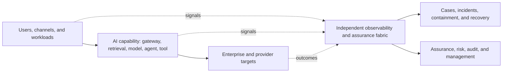
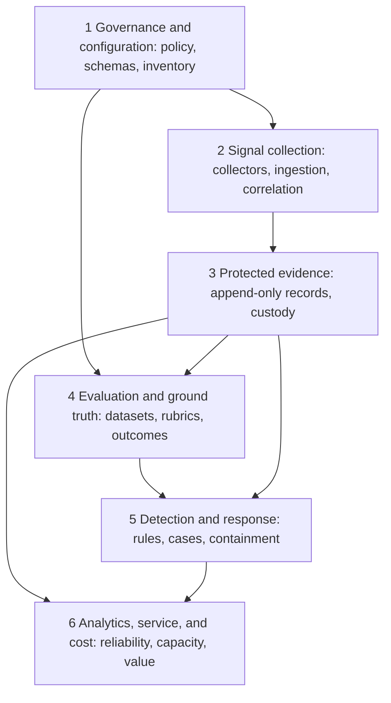
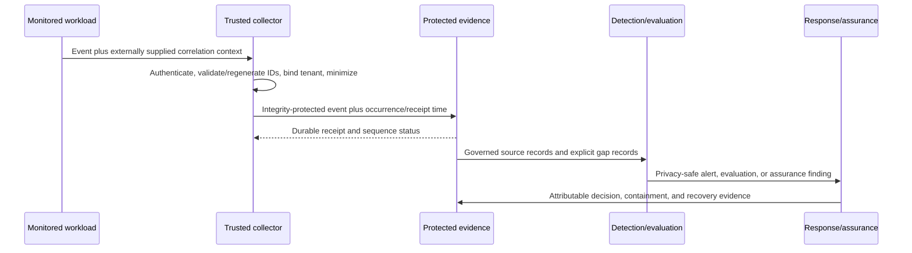
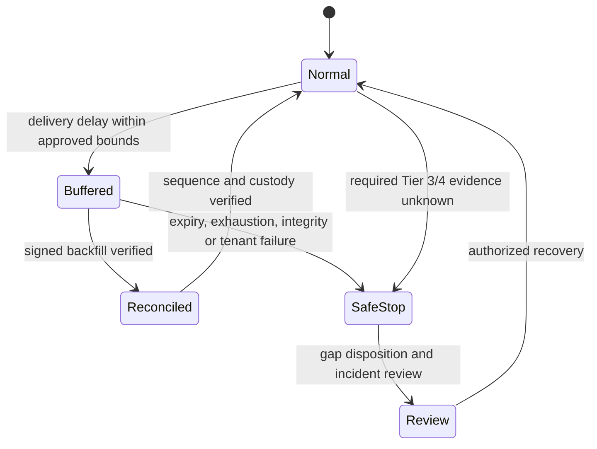

# ARC-P160 AI Observability

## Metadata

**Pattern ID:** ARC-P160

**Status:** Draft

**Version:** 0.1.0

| Field | Value |
|---|---|
| Owner | Enterprise Architecture |
| Required reviewers | Security Architecture, Privacy, Data Governance, AI Engineering, Operations, Model Validation, Assurance |
| Approval date | Not approved (Draft) |
| Review date | Before approval; then at the organization-defined architecture review interval |
| Pillars | Protect AI, Utilize AI, Govern AI |
| Lifecycle stages | Architecture, Development, Validation, Approval, Deployment, Operations, Monitoring, Retirement |
| Capability tiers | Tier 0 through Tier 4 |
| Deployment models | Cloud, hybrid, on-premises, edge or disconnected |
| Primary pattern role | Supporting observability and assurance pattern; primary when shared assurance is the dominant capability |
| Supersedes | None |

## Purpose

Provide an independent, privacy-tiered observability and assurance fabric for attributable AI identity, input, context, retrieval, model, output, tool, action, policy, configuration, behavior, quality, performance, cost, evidence, and outcome signals.

## Problem statement

AI execution crosses applications, models, retrieval services, agents, tools, targets, providers, and administrative systems. Fragmented logging loses attribution, causal context, tenant boundaries, outcome evidence, and custody. Centralizing raw content creates privacy risk, while relying on runtime logs, provider consoles, dashboards, or self-evaluation lets monitored parties select the evidence used to assess them.

## Intended outcomes

- Complete, attributable, risk-proportionate signal coverage across request and action chains.
- Centrally governed telemetry contracts with distributed collection and federated evidence where required.
- Content minimization through four governed capture modes and tenant-scoped lifecycle controls.
- Protected source evidence, trustworthy lineage, bounded time, integrity, and custody independent of monitored runtimes.
- Governed evaluation, ground truth, drift, security detection, response, service, capacity, and cost analysis.
- Actionable privacy-safe alerts and safe failure when required Tier 3 or Tier 4 assurance is unknown.

## Non-goals

This pattern does not select products, prescribe vendor configuration, define universal quality thresholds, create production dashboards, claim external-standard mappings, or set industry-specific retention schedules. It does not make monitoring a substitute for preventive controls, business accountability, causal outcome assessment, or capability-specific authorization.

## Applicability

Use ARC-P160 with capabilities that need shared evidence, monitoring, evaluation, incident integration, or operational assurance. It normally supports ARC-P100 through ARC-P150 and may be primary for an enterprise assurance fabric. Apply enhanced isolation, independent assurance, commit-blocking evidence, and continuity testing to Tier 3 and Tier 4 capabilities. All tiers use risk-proportionate coverage; Tier 0 experimentation remains isolated and governed.

## Assumptions and prerequisites

- Capability, tenant, purpose, tier, lifecycle state, owners, sources, and material enforcement points are inventoried.
- Enterprise identity, classification, privacy, key management, incident, continuity, records, and assurance functions exist.
- Source and provider limitations, clock quality, outcome systems of record, and responsibility boundaries are documented.
- Organization-defined parameters exist for capture, sampling, retention, latency, buffering, thresholds, escalation, and recovery.
- Monitored workloads cannot administer authoritative evidence or assurance verdicts.

## Prohibited uses

The pattern shall not be used to justify indiscriminate content capture, shared cross-tenant telemetry access, hidden employee or customer surveillance, or reliance on dashboards and aggregate metrics as authoritative evidence. It cannot support acceptable risk where required source identity, tenant binding, privacy policy, integrity, outcome evidence, or assurance independence cannot be established. A provider evidence gap that prevents required assurance prohibits the affected tier, action, or provider use.

## Architecture views

### Figure 1. Context view

### Figure 2. Component and plane view

### Figure 3. Event-flow view

### Figure 4. Evidence-continuity view

Deployment may be central, federated by region or tenant, a high-assurance enclave, provider-assisted, privacy-maximized, or edge/disconnected. Governance contracts remain common; evidence paths and assurance administration remain separate from ordinary runtime and administrative paths.

## Actors and identities

| Actor | Identity and authority expectations |
|---|---|
| Human or workload source | Enterprise identity bound to tenant, capability, purpose, environment, and lifecycle state |
| Telemetry source and collector | Managed identity and attestation; least-privilege schema publication and evidence delivery |
| Evidence custodian | Separate privileged identity administering storage, custody, legal hold, and integrity verification |
| Evaluator or detector | Versioned identity, rule or rubric, population authority, and conflict-of-interest record |
| Operations and incident responder | Scoped case, containment, suppression, and recovery authority with attributable decisions |
| Assurance assessor | Organizationally and technically independent identity with direct source and gap access and sample-selection authority |
| Provider | External asserted identity whose evidence is independently corroborated where assurance requires it |

Signing and attestation key lifecycle covers trust anchors, identity binding, issuance, protected or non-exportable storage where supported, rotation, revocation, compromise response, algorithm agility, verifier configuration, and time validity. Evidence trust roots and timestamp anchors are separately administered from evidence storage. Privileged tenant support or break-glass access requires dual authorization, bounded purpose and duration, and tenant-visible audit where appropriate.

## Data and instruction flows

The telemetry contract records schema and event version; event and capture mode; occurrence, receipt, and processing times; clock quality and uncertainty; source identity, attestation, component and deployment; tenant, capability, tier and purpose; trace, span, parent, session, workflow, transaction and lineage; principal, runtime, agent, model, provider, retrieval, tool, target, policy, approval and evaluation references; classified content references; decision, result, resource use and cost; sequence, replay, integrity, delivery and gap status; and retention, residency, hold and access class.

Externally supplied correlation identifiers are untrusted inputs. At boundaries they are issued or validated, tenant- and capability-namespaced, checked for collision and reuse, and regenerated when provenance is absent. They never authorize access or action.

Capture modes are:

1. **Metadata only:** the default when content is unnecessary.
2. **Derived signal:** a non-reconstructable verdict, fingerprint, length, score, class, or feature.
3. **Redacted excerpt:** narrowly approved diagnostic content.
4. **Exceptional protected full content:** segregated content-evidence vault capture under explicit authorization.

Derived signals, including embeddings, stable hashes and rare features, are classified and tested for re-identification and linkability. Purpose and tenant isolation, scoped or keyed transforms, retention, correction, deletion, and legal hold extend to derived stores. Sampling cannot omit denials, incidents, gaps, material decisions, or consequential outcomes.

Actionable alerts use a governed contract containing severity and confidence; affected tenant, capability, and tier; trace and protected-evidence references; detector and rule identity and version; observed and expected condition; a privacy-safe summary and recommended containment; accountable owner, routing destination, escalation path, and response objective; suppression state and authorizing identity; and incident, change, risk, or exception linkage. Suppression, tuning, closure, and severity changes are attributable, authorized, time-bounded where applicable, and reviewable. Tier 3 and Tier 4 evidence gaps, contradictory target outcomes, integrity failures, and containment failures trigger immediate escalation. Alert payloads reference protected evidence rather than copying sensitive source content.

## Trust boundaries

Sources may occur in Z0 through Z6; governance, collection control, evidence, detection, response, and assurance reside logically in Z7. Each crossing records identity, authorization, classification, schema and integrity validation, encryption, tenant binding, correlation, delivery, timeout, capacity, provider responsibility, and failure behavior. Z7 evidence access never provides an unmonitored path back into workloads or targets. External provider services remain Z0 regardless of contract.

Tenant identity shall be bound at the source and independently validated at ingestion. Tenant isolation shall be enforced across encryption and key-management policy; indexes, search, and query authorization; dashboards and joins; caches; exports; evaluation datasets and detector or evaluator training data; alert routing; incident attachments; backup and restore; tenant migration; and support or break-glass access. Controls shall also address timing, high-cardinality, and other shared-resource side channels. Exceptional cross-tenant support or break-glass access requires dual authorization, bounded purpose and duration, and tenant-visible audit where appropriate; ordinary administrative privilege does not imply cross-tenant evidence access.

Every external-provider integration shall maintain a governed gap register that records available and missing fields; export delay and completeness; clock and identifier semantics; content, data-use, and retention terms; subprocessors and residency; administrative visibility; outage, throttling, and backfill behavior; integrity and deletion capabilities; and portability and exit. The register shall identify accountable owners, review triggers, and compensating enterprise-boundary evidence for each material gap. Provider evidence remains externally asserted unless independently corroborated. When a material gap prevents required assurance, the affected tier, action, or provider use is prohibited rather than represented as observable.

## Components and responsibilities

| Component | Required responsibility |
|---|---|
| Governance and schema registry | Inventory sources; version contracts, classifications, capture, sampling, retention, alerts, evaluations, exceptions, and rollback |
| Collectors and secure ingestion | Authenticate, attest, minimize, validate, tenant-bind, replay-check, rate-limit, buffer, and confirm delivery |
| Correlation, time, and lineage services | Preserve causal parentage, source sequence, occurrence/receipt time, clock uncertainty, duplicates, gaps, late events, and transformation lineage |
| Protected evidence store | Independently administered append-only or WORM-capable records, access, custody, legal hold, integrity and loss detection |
| Evaluation and ground-truth registry | Version datasets, slices, rubrics, labels, outcomes, adjudication, confidence, limitations, finality windows and corrections |
| Detection and response | Stateful security, policy, quality, drift and gap detection; privacy-safe routing, case management, containment and recovery verification |
| Analytics, service, capacity, and cost | Traceable operational aggregation that never replaces source evidence |
| Assurance service | Independently select samples, inspect source and gap evidence, record conflicts, sign findings, and escalate outside monitored management |

Ground truth records target-of-record provenance, outcome-finality windows, delayed or censored outcomes, missingness, correction and version semantics, confounding review, and holdout separation. Late evidence and ground-truth corrections amend prior records explicitly rather than silently rewriting them.

## Required controls

| Allocation | Controls | Implementation and evidence responsibility |
|---|---|---|
| Monitoring | `MON-100`, `MON-110`, `MON-120`, `MON-140`, `MON-150` | AI Service Owner, Security Operations, Model Owner, and control-point owners |
| Governance and risk | `GOV-130`, `RSK-110`, `RSK-120`, `RSK-140` | Capability owners and Enterprise Risk Management |
| Assurance | `AUD-100`, `AUD-110`, `AUD-120`, `AUD-130`, `AUD-140` | Assurance and Internal Audit with required independence |
| Operations | `OPS-100`, `OPS-110`, `OPS-120`, `OPS-130`, `OPS-140` | Service Operations, Incident Response, Continuity, and technical owners |
| Data and identity | `DAT-100`, `DAT-110`, `DAT-120`, `DAT-130`; `IAM-100`, `IAM-110`, `IAM-120`, `IAM-130`, `IAM-140`, `IAM-150` | Data Owner, Privacy, IAM, and workload owners |
| Compliance, platform, integration | `CMP-100`, `CMP-110`; `INF-140`, `INF-150`, `API-110` | Compliance, Platform Engineering, and API Owner |
| Architecture and application | `ARC-100`, `ARC-110`, `ARC-130`, `ARC-140`; `APP-100`, `APP-110`, `APP-120`, `APP-130`, `APP-140`, `APP-150` | Enterprise or Solution Architecture and Application Owner |
| Model | `MOD-100`, `MOD-120`, `MOD-130` | Model Owner and Model Validation Lead |

`ARC-120`, `ARC-150`, `OPS-150`, and `MOD-140` are normally inherited or consumed and require verification. Conditional controls are `MON-130` for agent workloads; `DAT-140`, `DAT-150`, `DAT-160`, `CMP-120`, `CMP-130`, `CMP-140`, `MOD-110`, `MOD-150`, `API-140` for provider-assisted observability, and `AGT-100`, `AGT-110`, `AGT-120`, `AGT-130`, `AGT-140`, `AGT-150`, `AGT-160` according to data, providers, jurisdiction, intellectual property, models, and agents. Catalog `owner_role` remains accountable; pattern roles produce implementation evidence without transferring accountability.

## Control points and overlays

| CP | Control point | Required outcome | Primary implementation and evidence owners |
|---|---|---|---|
| CP1 | Telemetry governance and schema registry | Versioned contracts, field classification, ownership, compatibility, and change control | AI Service Owner, Data Governance, Platform Engineering |
| CP2 | Source instrumentation and identity | Attributable signals from every material decision and enforcement point | Workload Owner, Observability Platform, Identity and Access Management |
| CP3 | Edge minimization and content policy | Apply approved capture mode before general telemetry distribution | Data Owner, Privacy, Ingestion Engineering |
| CP4 | Secure ingestion and tenant binding | Authenticate source, validate schema, bind tenant, reject replay, quarantine invalid events, and enforce limits | Observability Platform, Identity and Access Management, Tenant Owner |
| CP5 | Correlation and lineage service | Reconstruct principal-to-model-to-retrieval-to-agent-to-tool-to-outcome paths | AI Service Owner, Source and Workload Owners |
| CP6 | Time, sequence, and integrity service | Preserve causal order, uncertainty, duplicates, gaps, signatures, transformation lineage, and custody | AI Service Owner, Evidence Custodian, Platform Engineering |
| CP7 | Protected evidence store | Maintain independently controlled append-only authoritative evidence with scoped access | AI Service Owner accountable; Evidence Custodian and Platform Engineering implement |
| CP8 | Evaluation and ground-truth registry | Govern datasets, labels, rubrics, evaluators, adjudication, outcome provenance, confidence, and limitations | Model Validation Lead, Data Owner, Assurance |
| CP9 | Drift and quality analytics | Detect material change by slice with confidence and approved thresholds | Model Owner, Evaluation and ML Operations |
| CP10 | Security detection and correlation | Detect abuse, policy bypass, authority misuse, evidence tampering, and provider gaps | Security Operations, Detection Engineering |
| CP11 | Alert, case, and incident broker | Route privacy-safe actionable alerts and preserve response decisions | Security Operations, Service Operations, Incident Response |
| CP12 | Cost, capacity, and service monitoring | Attribute usage and detect exhaustion, runaway behavior, and degradation | AI Service Owner, Site Reliability Engineering, Financial Operations |
| CP13 | Retention, residency, deletion, and legal hold | Enforce lifecycle obligations across raw, derived, archived, ticketed, and exported telemetry | Data Owner, Privacy, Compliance, Records Management |
| CP14 | Evidence continuity and degraded-mode controller | Detect loss, bound buffering, stop unsafe activity, reconcile backfill, and authorize recovery | Business Continuity, AI Service Owner, Site Reliability Engineering; Assurance verifies |
| CP15 | Assurance and reporting | Independently verify completeness, control operation, outcomes, and executive reporting | Executive Leadership accountable for management review; Internal Audit and Assurance independently assess |

Apply overlays for Tier 3 and Tier 4, personal or regulated data, multi-tenancy, external providers, agents, production actions, safety impact, high-assurance enclaves, and edge/disconnected operation.

## Architecture decisions and parameters

The mandatory decision is an independent, privacy-tiered observability and assurance fabric. Organization-defined parameters cover source coverage; schema compatibility; capture and sampling; content approvals; clock uncertainty; delivery delay; buffer duration and volume; integrity algorithms and key rotation; retention, residency, deletion and hold; evaluation populations, finality and corrections; drift confidence and sample sizes; alert severity and response objectives; automated-response blast radius; Tier 3 and Tier 4 commit-blocking evidence; recovery authorization; and review frequency.

No perfect global order is assumed. Causal parentage, source sequence, transaction state, target-native records, occurrence time, receipt time, synchronization quality, and uncertainty jointly reconstruct ordering. Transformations preserve source references and before-and-after integrity relationships. Provider telemetry remains externally asserted unless corroborated.

## Failure modes and abuse cases

| Failure or abuse | Required treatment |
|---|---|
| Spoofed source, correlation collision, replay, schema drift, or telemetry injection | Reject or quarantine; record gap; regenerate untrusted identifiers; investigate source and verifier state |
| Clock regression, late, duplicate, missing, or out-of-order event | Preserve original times and uncertainty; reconcile causally; explicitly amend prior results |
| Signing key compromise or privileged evidence alteration | Revoke trust, preserve custody, verify against separate trust roots and timestamp anchors, and reassess affected evidence |
| Content, derived-signal, tenant, export, ticket, cache, or dashboard leakage | Stop distribution, contain access, honor correction/deletion, assess side channels, and notify under applicable obligations |
| Evaluator manipulation, benchmark contamination, label drift, or premature outcome finality | Quarantine affected evaluations, use independent adjudication, version corrections, and reassess releases |
| Alert poisoning, false-positive storm, suppression abuse, or containment abuse | Authenticate inputs, bound rate/concurrency/blast radius, require independent confirmation or human approval for broad containment, and use circuit breakers |
| Provider export delay, incompleteness, changed semantics, or outage | Record the gap, use enterprise boundary evidence, prohibit use where assurance cannot be met, and execute portability or exit plans |
| Evidence, correlation, outcome, integrity, or assurance unavailable | Stop Tier 3 and Tier 4 consequential commit and dependent activity; do not report success |

## Fallback recovery and retirement

Lower-tier operation may enter only a preapproved degraded mode with protected local buffering, explicit duration and volume, visible status, and no increase in data, authority, provider, or action scope. Missing tenant binding, unverifiable telemetry, privacy-policy failure, expiry, or buffer exhaustion causes fail-safe rejection. Monitoring failure cannot bypass enforcement.

Recovery validates signed backfill, sequence reconciliation, integrity and custody, gap disposition, privacy obligations, material incident review, and authorized return to normal. Applicability matrices define commit-blocking evidence, source, tolerated delay, degraded state, recovery condition, and change authority for each capability and action class. Retirement disables sources and credentials, exports or disposes records under retention and hold, cryptographically erases prohibited content while preserving signed tombstones, verifies deletion from derived stores and backups, and retains required assurance evidence.

## Evidence and assessment

Required evidence includes the control-point assurance matrix; telemetry inventory, coverage, contracts and gap register; end-to-end traces; capture approvals; privacy and tenant-isolation tests across encryption and KMS policy, indexes/search/query, dashboards/joins, caches, exports, evaluation and training data, alert routes, incident attachments, backups/restores, migration, privileged access, and side channels; integrity, time, sequence, replay, transformation and custody tests; per-provider integration gap registers and compensating enterprise-boundary evidence; evaluation datasets, slices, rubrics, ground-truth provenance, finality, corrections, adjudication, confidence and contamination controls; drift evidence; detection rules, alerts, cases, incidents, suppression and response exercises; service, cost and capacity evidence; lifecycle tests for retention, deletion, residency, export, tickets and legal hold; continuity exercises for outage, throttling, buffering, exhaustion, backfill, safe stop, portability, exit, and recovery; and independent assurance.

Negative testing covers missing, late, duplicate, out-of-order, replayed and spoofed events; clock skew; injection; cross-tenant encryption-key or KMS-policy access, index/search/query, dashboard join, cache, export, evaluation-dataset, detector/evaluator-training, alert-route, incident-attachment, backup/restore, migration, support/break-glass, timing, and high-cardinality leakage; privileged alteration; secret or personal-data leakage; unauthorized rule changes; routing and backpressure failure; provider outage, throttling, incomplete export, failed backfill or deletion, and exit failure; evidence integrity failure; containment abuse; and unsafe automated response. Assessment proves runtimes and ordinary administrators cannot select, suppress, rewrite or delete authoritative evidence or verdicts, and that provider gaps cannot be hidden by unsupported assurance claims. Operational dashboards and aggregates remain traceable conveniences, never authoritative evidence.

## Variants and alternatives

- **Central assurance fabric:** prefer shared services where residency, latency, and tenant obligations permit; it simplifies governance and correlation but concentrates capacity and administrative risk. Use a federated fabric when regional control or isolation is material.
- **Federated regional fabric:** use regional evidence under common schemas when residency, latency, or blast-radius constraints outweigh central simplicity; cross-region correlation and assurance aggregation require explicit gap handling. Prefer central services when those constraints do not apply.
- **High-assurance enclave:** use isolated evidence, evaluation, detection, keys, and administration for Tier 4, regulated, or unusually sensitive workloads; accept greater cost and operational separation. Prefer central or federated services for lower-risk workloads when shared administration is acceptable.
- **Provider-assisted:** use provider signals to improve provider-internal visibility where export semantics and gaps are documented; external assertions never replace enterprise boundary evidence. Prefer enterprise-only collection when provider evidence adds no material assurance or cannot meet privacy and portability requirements.
- **Edge or disconnected:** use a signed local journal where connectivity cannot be assured; bounded offline capacity, delayed detection, key custody, and reconciliation are explicit trade-offs. Prefer connected central or federated collection when required evidence delay cannot tolerate disconnection.
- **Privacy-maximized:** default to metadata and derived signals where content risk exceeds diagnostic value; reduced forensic detail is accepted and exceptional protected content requires approval. Prefer ordinary risk-tiered capture where approved excerpts are necessary and proportionate.
- **Research and experimentation:** allow broader approved diagnostics only in isolated non-production environments to investigate behavior; evidence and configurations are not silently promoted. Use another execution pattern and production capture policy before deployment or consequential use.

## Anti-patterns

- Logging only final prompts and responses or collecting all content just in case.
- Treating application logs, dashboards, provider consoles, aggregates, transport success, or model self-evaluation as authoritative evidence.
- Sampling away denials, incidents, gaps, material decisions, or consequential actions.
- Correlating through raw content or personal identifiers.
- Letting monitored runtimes or ordinary administrators delete evidence, choose samples, suppress exceptions, or select verdicts.
- Assuming timestamps alone establish global order or silently rewriting late evidence and corrected ground truth.
- Using average quality without slices, confidence, limitations, or outcome-finality rules.
- Sending raw sensitive content to alerts, tickets, email, or chat.
- Sharing tenant indexes, keys, query roles, exports, caches, evaluations, or incident attachments without isolation.
- Silently dropping events, widening scope in degraded mode, or continuing Tier 3 or Tier 4 consequential activity with unknown assurance.

## Related patterns

- `ARC-P100` supplies shared gateway, model, provider, policy, identity, routing, and enforcement evidence.
- `ARC-P110` supplies human-facing copilot interaction, feedback, and oversight signals.
- `ARC-P120` supplies retrieval, context, grounding, citation, corpus, and semantic-memory evidence.
- `ARC-P130` supplies agent identity, lineage, delegation, tool, action, transaction, outcome, and containment evidence.
- `ARC-P140` supplies private model, runtime, infrastructure, adaptation, and deployment evidence.
- `ARC-P150` supplies reusable service, API, integration, target, and provider-boundary evidence.

Source patterns remain responsible for their event semantics and preventive enforcement. Target systems remain authoritative for transaction state. Capability owners remain accountable for business outcomes. ARC-P160 produces evidence and assurance; it does not authorize access or action and does not transfer catalog accountability.

## Change history

| Pattern version | ESAF release | Date | Change |
|---|---|---|---|
| 0.1.0 | 0.4-alpha | 2026-07-12 | Initial draft |
